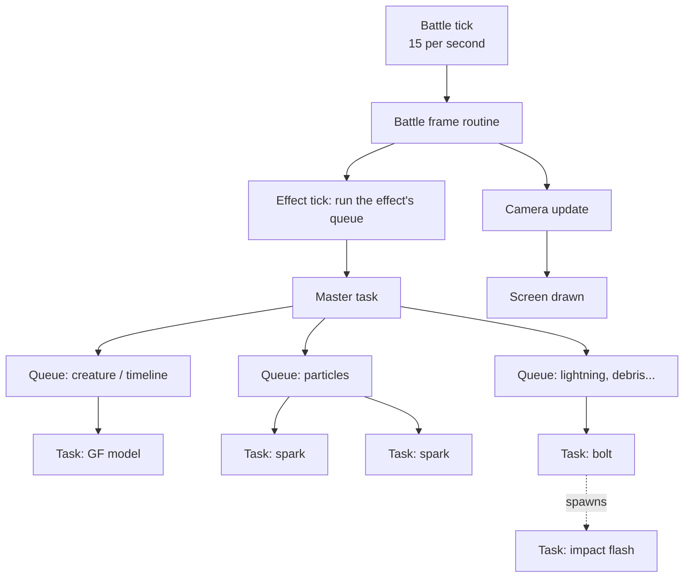
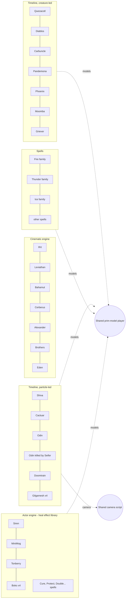
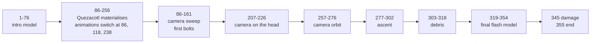
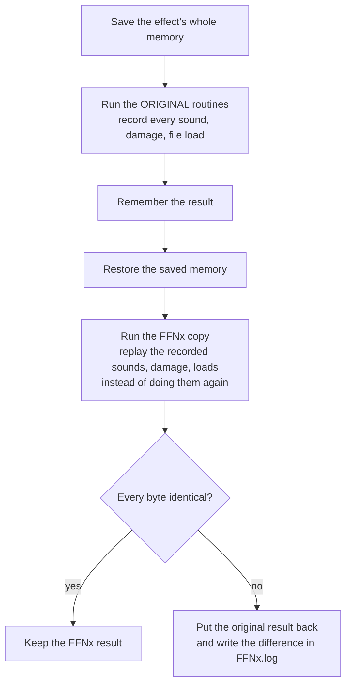
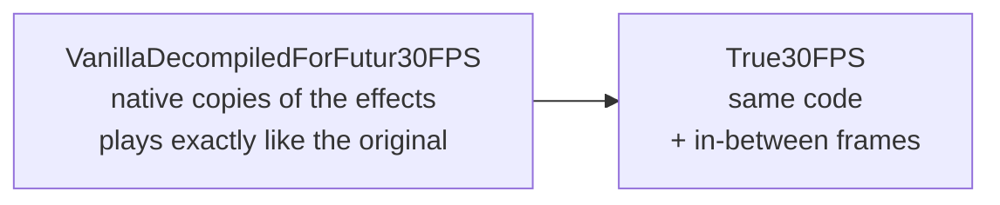
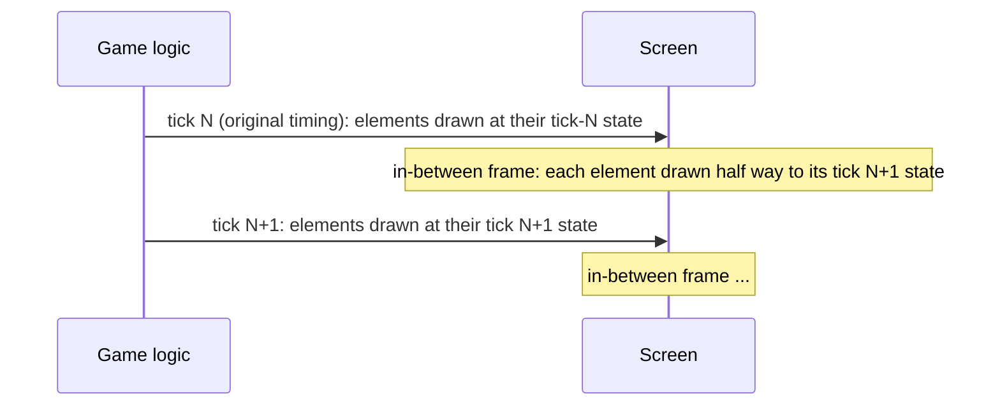

# Battle effects and true 30 fps

This page explains how FF8 animates its battle effects — GF summons and spells — and how the FFNx
**True30FPS** work makes them run at a real 30 frames per second without changing how they play.
It is written for readers who know FF8 well but do not read code: every mechanism is described by
what it does on screen. The detailed technical pages are linked in each section.

1. TOC
{:toc}

---

## The battle runs 15 times per second

Everything that *happens* in a battle — a GF moving, a particle flying, a damage number appearing — is
computed in steps called **ticks**. The battle computes **15 ticks per second**. Each tick the game
moves every object one step forward and draws the result; the screen therefore shows 15 different
pictures per second during effects.

FFNx can present 30 frames per second. The picture between two ticks — the **in-between frame** —
has to come from somewhere. The two naive answers both fail:

| Naive approach                     | What it looks like                                                            |
|------------------------------------|-------------------------------------------------------------------------------|
| Run the battle 30 times per second | Everything plays twice as fast: summons, damage timing, ATB, music sync break |
| Show each tick twice               | The effect still moves at 15 pictures per second: no gain                     |

True 30 fps keeps the game's logic at exactly 15 ticks per second — the same summon, the same timing,
the same random numbers, the same damage — and **draws each in-between frame at the exact halfway
state** of every moving object.

---

## How an effect is organised: tasks and queues

An effect is not an animation file played by a generic player. It is **code**: every spell and every GF
summon has its own small program in the game executable. That program is split into **tasks**.

A task is one living element of the effect: a spark, a lightning branch, the GF model, a camera move, a
fade. It has a small block of memory (its position, speed, age, colour…) and a routine the game calls
once per tick. The routine draws the element and moves it one step. When the element has finished — the
spark has faded, the fade is complete — the routine says so and the task is removed.

Tasks live in **queues** (lists of tasks). An effect usually has a **master task** that owns several
queues and runs them in a fixed order every tick; tasks can add new tasks (a bolt spawning a flash, a
creature spawning debris).

The same task-queue machine runs the whole battle (models, hit effects, the camera), which is why an
effect can move the camera, hide a target, or wait for a file to finish loading.

---

## The effect families

Almost 350 effect programs exist (spells, GF summons, limit breaks, enemy attacks). They were written by
different people, but most fall into a handful of **families** that share the same structure. Knowing
the family of an effect tells you how it animates.

| Effect                                    | Effect id     | Family                   |
|-------------------------------------------|---------------|--------------------------|
| Quezacotl — Thunder Storm                 | 116           | Timeline, creature-led   |
| Diablos — Dark Messenger                  | 325           | Timeline, creature-led   |
| Carbuncle — Ruby Light                    | 278           | Timeline, creature-led   |
| Pandemona — Tornado Zone                  | 291           | Timeline, creature-led   |
| Phoenix — Rebirth Flame                   | 140           | Timeline, creature-led   |
| Moomba — Friendship                       | 338           | Timeline, creature-led   |
| Griever (boss summon)                     | 069           | Timeline, creature-led   |
| Shiva — Diamond Dust                      | 185           | Timeline, particle-led   |
| Cactuar — 1000 Needles                    | 199           | Timeline, particle-led   |
| Odin — Zantetsuken                        | 187           | Timeline, particle-led   |
| Odin killed by Seifer                     | 326           | Timeline, particle-led   |
| Doomtrain — Runaway Train                 | 191           | Timeline, particle-led   |
| Gilgamesh (4 outcomes)                    | 327-330       | Timeline, particle-led   |
| Ifrit — Hell Fire                         | 201           | Cinematic engine         |
| Leviathan — Tsunami                       | 006           | Cinematic engine         |
| Bahamut — Mega Flare                      | 202           | Cinematic engine         |
| Cerberus — Counter Rockets                | 203           | Cinematic engine         |
| Alexander — Holy Judgment                 | 204           | Cinematic engine         |
| Brothers — Brotherly Love                 | 205           | Cinematic engine         |
| Eden — Eternal Breath                     | 206           | Cinematic engine         |
| Siren — Silent Voice                      | 095           | Actor engine             |
| MiniMog — Moogle Dance                    | 096           | Actor engine             |
| Tonberry — Chef's Knife                   | 090           | Actor engine             |
| Boko — ChocoFire / Flare / Meteor / Bocle | 097-100       | Actor engine             |
| Fire, Fira, Firaga                        | 2, 142, 143   | Spell (director + parts) |
| Thunder, Thundara, Thundaga               | 3, 102, 105   | Spell (director + parts) |
| Blizzard, Blizzara, Blizzaga              | 144, 103, 104 | Spell (director + parts) |

### Timeline family, creature-led

Quezacotl, Diablos, Carbuncle, Pandemona, Phoenix, Moomba and Griever share one design. The master task
starts, and two ticks later it spawns the **creature task**. The creature task is the conductor: it keeps
a tick counter and every event of the summon happens at a fixed tick number — the GF materialising,
each camera cut, each lightning bolt, each file load, the damage. The master task then runs the
creature, the creature's parts, and the particle queues in a fixed order.

Quezacotl's timeline shows the idea (tick numbers counted from the creature's start):

When the timeline asks for a file (the next part of the summon's graphics), it **waits**: the same tick
repeats until the file is loaded. On a slow disk the summon therefore pauses for a moment without
desynchronising anything.

The GF model is a normal battle model (skeleton + animations, the same format as monsters). A detail
that matters for 30 fps: when the creature task draws the model, it uses the pose computed at the end
of the *previous* tick — the model is always drawn one tick "late" relative to its animation counter.

### Timeline family, particle-led

Shiva, Cactuar, Odin, Odin killed by Seifer, Doomtrain and Gilgamesh also run on a tick-counted
timeline, but the timeline mostly spawns **many small tasks** — ice rings, needles, steam puffs,
sword trails — into one shared sub-queue. Each small task animates itself for its own lifetime.

These effects support a **draw-only mode**: while the battle logic is paused, every task still draws but
does not advance. Their camera is not moved by the effect itself but by a **shared camera
script** (the code lives in Doomtrain's program and is reused by all of them): a small list of camera
moves — jump to a point, glide linearly, ease in/out, follow a curve, change zoom, change roll — played
one after the other.

Gilgamesh is one program for four summons: the outcome (Zantetsuken, Masamune, Excalibur, Excalipoor)
only selects which sword attack the timeline plays.

### Cinematic engine

Ifrit, Leviathan, Bahamut, Cerberus, Alexander, the Brothers and Eden are driven by a **script
interpreter**: the summon's `.00` / `.01` files contain a byte-code program that places up to 128
"bones" (GF body parts, rocks, flames, cameras…), gives them speeds and accelerations, and chooses how
each is drawn. Each tick the engine runs the script until it waits, moves every bone by its speed, then
draws every bone through a table of draw routines (meshes, sprites, particle fountains, trails…).

The engine exists seven times in the executable — one compiled copy per GF — with small differences
(Leviathan has lit meshes, Eden has its own screen effects, the Brothers attach battle models). The
spells Water and Meteor use the same program layout. See
[GF cinematic engine](GFCinematicEngine.md) and [GF cinematic script](GFCinematicScript.md).

### Actor engine (the heal effect library)

Siren, MiniMog, Tonberry and the four Boko effects are built from a library of about 120 routines —
emitters, particle actors, sprite strips, a creature actor with states, a camera stepper — that also
powers the heal and support spells (Cure, Protect, Double…). The library is copied into each module, so
every copy reads its own memory but behaves identically. A module adds its own director (what to spawn
when) and a few specific routines (Tonberry walking with his lantern, ChocoMeteor's meteor fall).

### Spells

A spell usually has a **root task** (waits for the target, plays the sound), a **director** (spawns the
parts at fixed ticks, one set per target) and **part tasks**: flames, sparks, embers, bolts, ice
shards, rings. Most parts are one of three kinds: a **sprite** (a 2D picture, often a flipbook of a
few frames), a **prim model** (a small 3D model with keyframed position/rotation/scale/colour) or a
**mesh** built on the fly (Blizzard's crystal, Thundaga's lightning). See
[Magic effect anatomy](MagicEffectAnatomy.md) and the case studies
([Fire](FireCaseStudy.md), [Firaga](FiragaCaseStudy.md), [Blizzard](BlizzardCaseStudy.md),
[Cure](CureCaseStudy.md)).

---

## Shared building blocks

Many families draw through the same few engine services. These matter for 30 fps because solving one of
them solves it for every effect that uses it.

| Building block             | What it does on screen                                                                                                                                      | Used by                                                   |
|----------------------------|-------------------------------------------------------------------------------------------------------------------------------------------------------------|-----------------------------------------------------------|
| Prim-model player          | Plays a small keyframed 3D model: each piece has a position, rotation, scale, colour, each either keyed on a frame or driven by a speed and an acceleration | About 300 places: most GFs and many spells                |
| Sprite sequence (flipbook) | Draws a 2D picture; the picture number advances every tick                                                                                                  | Sparks, flames, smoke everywhere                          |
| Battle model animation     | Reads the next pose of a skeleton model and builds its bone matrices                                                                                        | Every GF creature, every monster/character                |
| Camera keyframe player     | Plays a camera "shot" from a camera file (eye, target, zoom, roll)                                                                                          | Battle cameras, some effects                              |
| Shared camera script       | Plays a list of camera moves written for one summon                                                                                                         | Shiva, Cactuar, Odin, Doomtrain, Gilgamesh                |
| Direct camera writes       | The effect writes the camera position itself every tick                                                                                                     | Timeline creature-led GFs, cinematic engine, actor engine |
| Screen flash / fade        | Brightens or darkens the whole screen by a level                                                                                                            | Almost every summon                                       |

---

## How the effects are made 30 fps

### Step 1 — rewrite every effect in FFNx, exactly

Because effects are code, the in-between frame cannot be produced by editing data. FFNx contains a
**native copy of every effect routine**: each task routine of the executable is rewritten as C++ that
does exactly the same thing — the same integer rounding, the same order of random numbers, the same
calls to sound and damage. When a task runs, FFNx runs its copy instead of the original.

Exactness is not taken on trust. While an effect plays, every tick is computed **twice**, from the same
starting memory:

So the game always continues exactly as the original would, sounds and damage happen once, and any
imperfection in a rewritten routine shows up in the log instead of on screen. The same comparison is
also run outside the game: a test program loads the executable, starts any effect by its id with fake
targets, and compares the original and the copy on every tick until the effect ends.

The work is kept in two layers (two branches of the FFNx fork):

The first layer alone changes nothing visible: it is the decompiled effect code, useful for any future
work (60 fps, editing effects). The second layer adds the in-between frames on top, through a few marked
hook points.

### Step 2 — draw the in-between frame

With an exact copy of each effect, FFNx knows everything the effect knows: where each element is, how fast
it moves, what the next tick will do. The in-between frame then **only draws**; it never moves the
effect forward, never draws a random number, never plays a sound.

The rule used everywhere is **exact vanilla shapes**: the in-between frame shows the true halfway point of
the original motion, and anything that changes in jumps keeps its jumps.

| What the element does                                          | In-between frame                                                                                             |
|----------------------------------------------------------------|--------------------------------------------------------------------------------------------------------------|
| Moves with a speed (sparks, embers, debris, falling ice)       | Half a step along the speed of this tick                                                                     |
| Spins, grows, fades by a fixed amount per tick                 | Half the amount                                                                                              |
| Follows a formula of the tick number (sine pulses, ring sizes) | The formula at tick + ½                                                                                      |
| Keyframed prim model                                           | The model evaluated at the next frame on a copy, then the halfway point                                      |
| Skeleton model (the GF, a target)                              | The halfway pose between two ticks, joints turning the short way round                                       |
| Flipbook sprite (flame art, bolt flicker)                      | Holds its picture — a flipbook has no half picture                                                           |
| Random events (a new lightning fork, a spawned particle)       | Stay at 15 per second; what they spawn moves smoothly afterwards                                             |
| Camera written by the effect                                   | The effect's camera code is run for the next tick on a copy, the camera is shown half way; a cut stays a cut |
| Camera shots and the shared camera script                      | Same: the next camera is computed on a copy and shown half way                                               |

Two examples:

**Quezacotl's lightning.** A bolt is a "stepping leader" that grows a few random steps per tick. The
growth stays in 15-per-second steps (the random shape is exactly the original's), while the glow fades
and the impact flashes move half way. The creature is drawn at the halfway pose — taking into account
that the creature's draw uses the previous tick's pose.

**Blizzard's crystal.** The shards fly out with a speed and spin; on the in-between frame each flying shard
is advanced half a step and drawn with half its spin, so the burst is smooth, while shards that settle
on the next tick hold their place.

### What stays at 15 steps per second on purpose

- Flipbook pictures (Fire's flame art, Thunder's bolt layers, sprite animations).
- Random growth (lightning branches, spawn bursts).
- Hard camera cuts and screen flashes that jump.
- Anything the original draws only on some ticks (it is shown the same way).

These keep the original look; only continuous motion gains the extra frames.

---

## Status (FFNx True30FPS)

| Group                                                | Native copy           | In-between frames               |
|------------------------------------------------------|-----------------------|---------------------------------|
| Timeline GFs, creature-led (7)                       | yes                   | yes                             |
| Timeline GFs, particle-led (6 programs)              | yes                   | yes                             |
| Cinematic engine GFs (7)                             | yes                   | yes                             |
| Actor engine GFs (Siren, MiniMog, Tonberry, Boko x4) | yes                   | yes                             |
| Fire, Thunder, Ice families                          | yes                   | yes                             |
| Other spells, limit breaks, enemy attacks            | in progress / not yet | generic replay of the last tick |

Effects without a native copy use the generic method: their in-between frame redraws the last tick's
picture with a generic position correction.

---

## Related pages

- [GF summon runtime](GFSummonRuntime.md) — how a GF command reaches its effect program.
- [GF cinematic engine](GFCinematicEngine.md) and [GF cinematic script](GFCinematicScript.md).
- [Magic effect anatomy](MagicEffectAnatomy.md) and [Magic spell effect runtime](MagicSpellEffectRuntime.md).
- [Magic effect interpolation (30 fps)](MagicInterpolation30fps.md) — the motion categories per draw engine.
- [Battle model animation timing](BattleModelAnimationTiming.md) — models and the battle clock.

---

## Reference (names & addresses)

FF8_EN.exe (Steam 2013, English 1.2).

| Name                                    | Address             | Role                                                      |
|-----------------------------------------|---------------------|-----------------------------------------------------------|
| `ExecuteTaskQueue`                      | 0x508420            | Runs every task of a queue once, removes finished tasks   |
| `AddTaskToQueue`                        | 0x508360            | Adds a task to a queue                                    |
| `BdLink` battle frame                   | 0x500900            | One battle tick                                           |
| Effect tick call                        | 0x50093A            | The call in the battle frame that runs the effect's queue |
| `Magic_GetIDLoad`                       | 0x50AF20            | Clears the magic buffer and loads an effect's files       |
| Effect setup table                      | 0xC81774            | Setup routine per effect id                               |
| Effect file loader table                | 0xC81DB8            | File loader per effect id                                 |
| `Effect_PrimPlayer_Play`                | 0x701970            | Shared prim-model player                                  |
| `ProcessCameraAnimation`                | 0x5035E0            | Camera keyframe player                                    |
| `MAG066_CamScript_Task`                 | 0x63E9C0            | Shared camera script                                      |
| `Battle_ReadAnimation`                  | 0x508F90            | Reads the next pose of a battle model                     |
| `BattleModel_BuildBoneMatricesFromPose` | 0x508C90            | Builds a model's bone matrices from its pose              |
| `BS_ComputeBonesWorldMatrices`          | 0x5095B0            | Places the bone matrices in the world                     |
| `GF_116Quezacotl_SequenceTask`          | 0x6C3760            | Quezacotl master task                                     |
| `GF_116Quezacotl_CreatureTask`          | 0x6C3940            | Quezacotl timeline (creature task)                        |
| `GF_199Cactuar_SequenceTick`            | 0x5AA3A0            | Cactuar master task                                       |
| Ifrit sequence tick                     | 0xB25DF0            | Cinematic engine tick (Ifrit copy)                        |
| `ActEng_MasterSequenceTick`             | 0x739F40            | Actor engine master task (Siren copy)                     |
| Battle camera eye / look-at             | 0xB8B7F0 / 0xB8B7F8 | Camera position written by effects                        |
