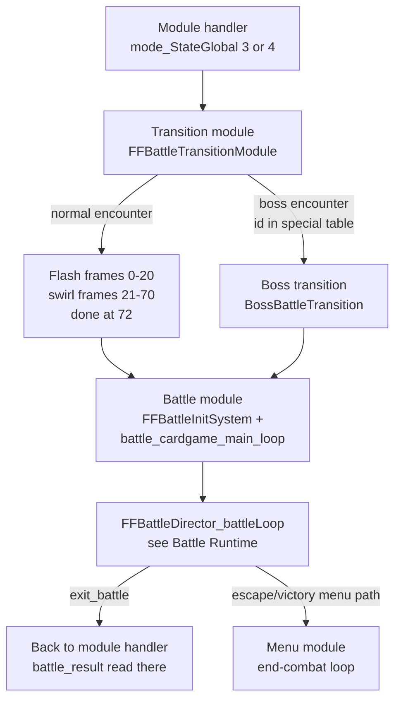

1. TOC
{:toc}

# Battle transition and module entry

This page documents the path between "a battle was requested" and "the battle state machine is running": the transition module (the encounter flash/swirl), the battle module shell, and how the battle hands control back to the engine. The battle initialization phases and per-frame tick themselves are covered in [Battle Runtime]({{ site.baseurl }}/technical-reference/battle/battle-runtime/); how field and world map request a battle is on [Engine startup and main loop]({{ site.baseurl }}/technical-reference/main/engine-startup-and-main-loop/) and the encounter data on [Encounter codes]({{ site.baseurl }}/technical-reference/battle/encounter-codes/).

## Overview



## Transition module

`FFBattleTransitionInitSystem` decides between the two transitions by scanning the **special-transition encounter table** (below) for `COMBAT_SCENE_ID`, captures the current screen (`normalBattleTransitionScreen` / `specialBattleTransitionScreen`), and picks the viewport based on the module the engine comes from (field 320×224, world map 320×224 at a different Y, other 320×240; doubled in high resolution).

`FFBattleTransitionModule` then runs one transition frame per engine frame with a counter (`transitionTimer`):

* **Normal transition** (`NormalBattleTransition`): frames 0–20 are the white flash ramp (intensity 0.05/frame), frames 21–70 the spin of the captured frame (0.02/frame step), and at frame 72 the transition reports completion.
* **Boss transition** (`BossBattleTransition`): the alternate effect used for the encounter IDs in the special table.

On completion the module switches to the battle module trio (`FFBattleInitSystem` / `battle_cardgame_main_loop` / `FFBattleExitSystem`) — the same trio the module handler registers directly for the card game (mode 8).

### Special-transition encounter table

`ENCOUNTER_WITH_SPECIAL_TRANSITION` is a hardcoded, 0xFFFF-terminated array of encounter IDs that use the boss transition:

```
9, 10, 13, 26, 27, 28, 29, 62, 63, 79, 83, 84, 94, 104, 118, 119, 120,
136, 147, 161, 164, 189, 190, 194, 216, 317, 326, 354, 363, 372, 377,
410, 431, 441, 462, 483, 511, 794, 795, 796, 810, 813, 832
```

Modders can extend or edit this list in place (each entry is a 16-bit encounter ID; keep the 0xFFFF terminator).

## Battle module shell

`FFBattleInitSystem` resets the module: `exit_battle` = 0, `GLOBAL_BATTLE_MOD_STATE` = countdown/load, clears the in-action block, and sets the logic rate — **15 fps for battles, 60 fps for the card game** (this is why battle animations step at 15 fps). The viewport is 320×216 (640×432 high-res), slightly shorter than field to leave room for the HUD.

`battle_cardgame_main_loop` runs every engine frame:

1. Pause handling (`CAN_BATTLE_BE_PAUSED`, `IS_BATTLE_PAUSED`; pausing mutes via the pause menu path).
2. HUD update/display, three times per frame, when the battle is in the HUD-active state (`mode_Battle_AnimationState` == 3).
3. `FFBattleDirector_battleLoop` — the actual state machine (initialization phases, active tick, card game states; see [Battle Runtime]({{ site.baseurl }}/technical-reference/battle/battle-runtime/)).
4. Swirl start: when the director raises `battle_swirl` (value 1 or 2), the shell captures the frame region and starts the in-battle swirl effect once, then clears the flag.
5. Exit: when the director sets `exit_battle`, the shell switches modules — normally back to `FFModuleHandler_main_loop` (which reads `battle_result` — see the result table on the engine page), but when `mode_Battle_AnimationState` == 4 (escape/end-combat menu path) it goes to the menu module with the end-combat main loop instead.

## mode_StateGlobal reuse inside the battle

While the battle module is active, the director re-purposes `mode_StateGlobal` as its own channel:

| Value (as seen in director) | Role |
|------------------------------|------|
| 3 (`IN_BATTLE`) | Normal battle execution (sub-machine `GLOBAL_BATTLE_MOD_STATE`, then `BATTLE_LOOP_FLOW_STATE`) |
| `SCREEN_END_BATTLE` | Loads `btitle.ovl` (battle results overlay) + hidden debug hook |
| `WHEN_ESCAPING` | Runs `battleComputeEndBattle`, sets the end-combat menu path (`mode_Battle_AnimationState` = 4) |
| 8 (`CARD_GAME_OR_DEBUG`) | Card game sub-machine (`CARD_GAME_MODULE_STATE`: 0 = init rules/textures/card counts, 1 = `UpdateCardGameFrame` until finished, 2 = teardown) |
| any other | Sets `exit_battle` = 1 and restores the proper end state |

The battle fade-out is driven by `FADE_OUT_END_BATTLE_DURATION` (starts at 255, decremented each frame once the end sequence begins; reaching 0 unloads the stage).

## Address table

| Name | Address | Description |
|------|---------|-------------|
| `FFBattleTransitionInitSystem` | 0x559530 | Transition setup: boss check, screen capture, viewport |
| `FFBattleTransitionModule` | 0x559890 | Per-frame transition; switches to the battle module when done |
| `FFBattleTransitionExitSystem` | 0x559820 | Transition cleanup |
| `NormalBattleTransition` | 0x559910 | Flash (0–20) + swirl (21–70) effect frames |
| `BossBattleTransition` | 0x559E40 | Boss transition effect frames |
| `normalBattleTransitionScreen` | 0x559690 | Screen capture for the normal transition |
| `specialBattleTransitionScreen` | 0x5597F0 | Screen capture for the boss transition |
| `isCurrentCombatSpecialTransition` | 0x47CC70 | Scans the special table for COMBAT_SCENE_ID |
| `ENCOUNTER_WITH_SPECIAL_TRANSITION` | 0xB80F9C | Boss-transition encounter ID list (0xFFFF-terminated) |
| `FFBattleInitSystem` | 0x47CE10 | Battle module init (15 fps battle / 60 fps card game) |
| `battle_cardgame_main_loop` | 0x47CF60 | Battle module shell (pause, HUD, swirl, exit) |
| `FFBattleExitSystem` | 0x47CEF0 | Battle module exit |
| `FFBattleDirector_battleLoop` | 0x47CCB0 | Battle/card state machine (see Battle Runtime) |
| `transitionTimer` | 0x204E2E8 | Transition frame counter |
| `bossBattle` | 0x204DB20 | 1 = boss transition selected |
| `exit_battle` | 0x1CFF830 | Module exit request flag |
| `GLOBAL_BATTLE_MOD_STATE` | 0x1CFF83C | Battle module sub-state |
| `BATTLE_LOOP_FLOW_STATE` | 0x1D27B04 | Battle flow state (load monsters → fighting) |
| `FADE_OUT_END_BATTLE_DURATION` | 0x1D27B0C | End-of-battle fade counter (255 → 0) |
| `battle_swirl` | 0x1CFF6F4 | In-battle swirl start request (1/2) |
| `COMBAT_SCENE_ID` | 0x1CFF6E0 | Encounter ID for this battle |
| `CURRENT_ENCOUNTER_ID` | 0x1D96DA8 | Copy used by the battle systems |
| `ENCOUTER_BATTLE_FLAG` | 0x1CFF6E2 | Battle flags (back attack, surprise, scripted...) |
| `battle_result_byte` | 0x1CFF6E7 | Outcome read by the module handler |

Addresses are for FF8_EN.exe (2000 PC release) as mapped in IDA (image base 0x400000).
