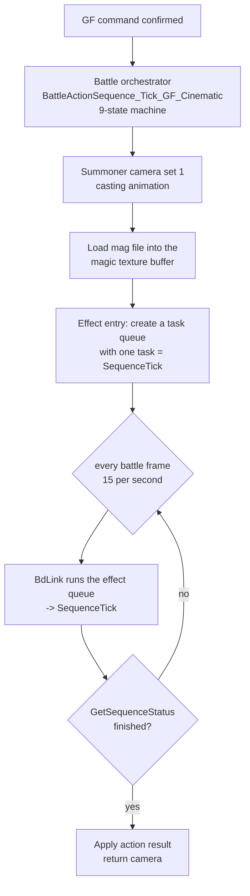
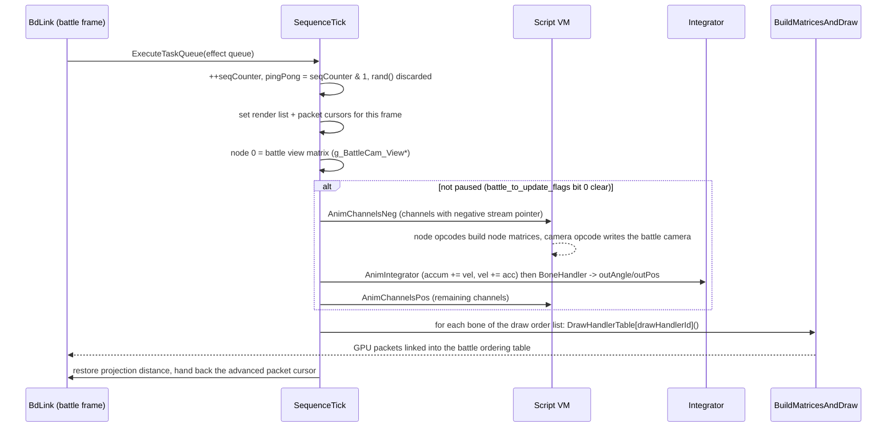
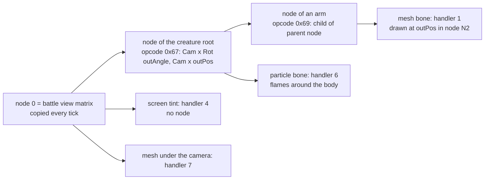
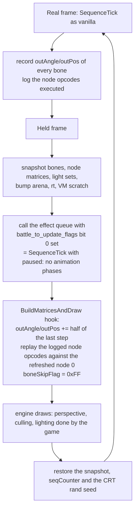

# GF cinematic engine (Ifrit family)

Seven Guardian Force summons are driven by one engine compiled seven times: **Ifrit** (effect 201),
Leviathan (6), Bahamut (202), Cerberus (203), Alexander (204), Brothers (205) and Eden (206). Each
copy has its own code addresses and its own data tables, but the structure, the runtime objects and
the script language are identical. This page describes the engine with Ifrit as the worked example,
then the design of its 30 fps rework. The other summon families (timeline and actor summons) are
listed in [GF Summon Runtime](GFSummonRuntime.md).

1. TOC
{:toc}

## What kind of animation it is

A cinematic summon is **not** a keyframe player. Nothing in the data says "at frame 40 the arm is
here". Instead the summon is a scene of a few dozen **bones** (generic animated objects: a mesh, a
particle emitter, a sprite, the camera, a light, or an invisible helper), and each bone runs up to
three small byte-code **scripts** that set velocities, accelerations and waits. An **integrator**
turns those into positions and angles every tick, and **draw handlers** turn the bones into GPU
packets. The choreography (where the creature flies, when the camera cuts, when the flames spawn)
is entirely in the scripts of the mag file; the creature's own posture is the one part that uses
ordinary battle-model keyframes (see [Draw handlers](#draw-handlers-ifrit)).

The byte code is specific to this engine. It is unrelated to the monster AI VM (`.dat` section 8),
to the AnimSeq VM of battle models (`.dat` section 5) and to the per-entity camera keyframes
(`.dat` section 6): different instruction format, different tables, different runtime. The only
contact points with the rest of the battle are the camera globals that the camera opcode writes,
the sound calls, and the embedded battle model of the creature.

## Lifecycle

The orchestrator is shared by all summon families. From its point of view a summon is one task
called 15 times a second until it reports completion; the whole cinematic lives inside that task.

## Runtime objects

Only one cinematic summon runs at a time, so the engine keeps its state in a fixed set of globals
(`g_GfCinematic_*`, listed in [Addresses](#addresses)).

| Object | Size | Role |
|--------|------|------|
| `GfCinematicSequenceCtx` (`ctx`) | 0xDC | The summon: sequence counter, flags, pause flag, pointer to the bone array (+0x90), packet cursors (+0x7C, +0xD8), a bump allocator for per-bone pools (+0x74) |
| `GfCinematicRuntimeSlot` (`rt`) | 0x50 | Per-tick cursors: current bone id (+0x42), current channel, current opcode (+0x4A), VM wait request (+0x3E), ping-pong index (+0x41), **freeze flag** `boneSkipFlag` (+0x45), render list pointer/cursor (+0x38/+0x4C) |
| `GfCinematicBone` | 0x100 | One animated object (table below) |
| Bone order list | 256 bytes | Which bones run scripts this tick, in order; 0xFF ends it; bit 7 = "keeps running while the others are frozen" |
| Draw order list | 256 bytes | Which bones are drawn this tick, in order (depth is decided by each bone's OT slot, not by this order) |
| Node matrices | 64 x 32 bytes | Transform hierarchy (see [Node matrices](#node-matrices-and-camera)); slot 0 = the camera |
| Light sets | 5 x 0x50 bytes | Light direction/colour matrices for lit meshes |
| Workspace (`ws`) | scratch | Per-call scratch: vertex buffers, draw-order cursor |

### Bone layout (GfCinematicBone, 0x100 bytes)

| Offset | Field | Meaning |
|--------|-------|---------|
| +0x12 | id | Bone id, key of its node matrix slot |
| +0x18 | boneHandlerId | How accumulators become outputs (BoneHandlerTable) |
| +0x1A | flags | Bit 0: integrate rotation acceleration; bit 3: integrate position acceleration |
| +0x1C | drawHandlerId | How the bone is drawn (DrawHandlerTable); 0 = not drawn |
| +0x1E | orientation | Sprite orientation type (handler 5) |
| +0x20.. | chanStreamPtr[3] | Script pointer of each channel (0 = unused; negative = runs in the first phase) |
| chanWait[3] | | Remaining wait of each channel, decremented by `chanWaitSpeed` |
| +0x48 | renderListOffset | OT bucket (depth layer) of this bone's packets |
| +0x4C | drawFlags | Bit 0: draw from the alternate packet pool; bit 1: per-vertex clip codes; bit 2: emitter variant |
| +0x50/54/58 | accumRot XYZ | 16.16 rotation accumulators |
| +0x5C/60/64 | accumPos XYZ | 16.16 position accumulators |
| (following) | velRot, velPos, accRot, accPos | 16.16 velocities and accelerations |
| **+0x8C/8E/90** | **outAngle XYZ** | s16, 4096 = one turn. Also XYZ scale (handler 2), billboard rotation (27), light colour |
| **+0x94/96/98** | **outPos XYZ** | s16 position in the parent node's space. Also RGB colour (handler 4), morph weights (handler 1) |
| +0x9A, +0x9E | uv / clut offsets | Texture addressing of the mesh |
| +0x9C | parentNodeId | Node matrix slot this bone is placed in (0 = camera) |
| +0xB8, +0xBC | descriptor / pool | Handler-specific: texture id, particle pool, embedded model block, morph descriptor |
| +0xC8, +0xCA | script speed, frame speed | Particle system rates (handler 6) |
| +0xCC | colour | Packed RGB + semi-transparency bit |
| +0xD0, +0xD8, +0xDC | frame script, current frame, timer | Sprite animation (handler 5) |
| +0xD8 | mesh pointer | Mesh handlers (same slot, different meaning) |
| +0xDE | option bits | OT bias, blending variants |
| +0xE1 | lightSlot | Light set used by the dispatcher (0 = unlit) |

## One tick

The three animation phases are the only place where the choreography advances. The draw pass reads
the outputs; three handlers also step their private animation while drawing (see
[State that advances in the draw pass](#state-that-advances-in-the-draw-pass)).

Because node 0 is copied at the start of the tick and the camera opcode writes the camera later in
the same tick, the summon's geometry is always drawn with the previous tick's camera. The rest of
the battle scene has the same one-frame lag, so everything stays consistent.

## The script VM

### Instruction format and channels

An instruction is 10 bytes: `{opcode, slot, param1, param2, param3}` as five 16-bit words. The
low 9 bits of the opcode word index a 512-entry `VmOpcodeTable` (one per GF); the high bits carry
per-opcode modifiers (component mask, write mode, rotation order). Opcodes read their operands
through the global stream cursor `g_GfCinematic_StreamCursor` and advance it themselves.

Each bone has three channels. A phase loops over the bone order list, then over the three channels
of the bone: a channel whose wait counter is positive is decremented by the bone's wait speed;
otherwise the VM executes opcodes back to back until one sets `rt->vmWaitRequest`. The requested
wait is added to the channel counter and the stream pointer is stored back into the bone.
Three scripts can therefore run on the same bone at once (typically move / rotate / recolour).

### Opcode groups

| Group | Opcodes | Effect |
|-------|---------|--------|
| Set / add values | write modes 0-5 with a per-component mask | Write an immediate or another bone's value into velocity, acceleration, accumulator or output, absolute or relative. "Move to X in N frames" = set the velocity, then wait N |
| Wait | | Set the channel wait; ends the channel for this tick |
| Freeze | 0x07 | `rt->boneSkipFlag` = 0xFF or 0 (bits 15/14 of the opcode word) and marks the current bone "keeps running": every other bone stops animating, including the draw-side animations |
| Node builders | 0x65, 0x66, 0x67, 0x69, 0x6A, 0xCB | Build this bone's node matrix from `outAngle`/`outPos`, node 0 (camera) and a parent node; pure functions of those inputs |
| Set parent | 0x68 | `bone->parentNodeId` = param1 |
| Camera and sound | 0x39 | Sub-op 0: battle camera position, look-at (another bone's `outPos`), projection distance = `outAngleX`, roll = `outAngleY`. Sub-op 1: stage camera animation. Sub-ops 2/3: sound voices. Sub-op 4: save the return view. Sub-op 8: arm the camera return |
| Light set | 0x93 | Build a light-direction matrix, a light-colour matrix and a back colour from three bones (Ifrit and Leviathan only; a stub in the other five) |

### Bone handlers

After integration, `BoneHandlerTable[boneHandlerId]` derives the outputs. Ifrit has 12 entries;
handler 0/1 is the plain case (`outPos` = high word of `accumPos`, `outAngle` = high word of
`accumRot`), handler 6 places the bone on the segment between two other bones with a ratio taken
from `accumRot`. The outputs are final once `AnimChannelsPos` has run.

## Node matrices and camera

A node matrix is 32 bytes: a 3x3 rotation, a projection value (0 = use the current battle
projection distance) and a translation. The 64 slots are keyed by bone id through a 64-entry key
table, allocated on first use. A bone that owns a node runs a node opcode every tick, so its slot
always reflects the current outputs. Draw handlers only read slots (`GetParentMatrix(parentNodeId)`),
falling back to node 0. Since every node embeds the camera, moving the camera moves the whole scene
without any per-bone work: this is what makes the held-frame redraw of the 30 fps rework exact for
camera moves.

The camera itself is a bone. Its script sets velocities and waits like any other bone, and
opcode 0x39 copies its `outPos` into `Battle_Camera_world`, another bone's `outPos` into
`Battle_Camera_LookAt`, and its `outAngle` into the projection distance and roll. The battle camera
module then builds the view matrix that the next tick copies into node 0.

## Draw handlers (Ifrit)

The draw table has 73 slots; a GF that does not use a handler has a `ret` in its slot. Ifrit uses:

| Id | Draws | Reads | Advances |
|----|-------|-------|----------|
| 1 | Mesh at `outPos` in the parent node, optionally morphed between two meshes with weights = another bone's `outPos`/256 | outPos, parent node, mesh, morph descriptor, colour, uv/clut | nothing |
| 2 | Same, with `outAngle` x16 as an XYZ scale | as 1 + outAngle | nothing |
| 3 | **The creature**: an embedded battle model (skeleton + keyframed animation) rendered through `RenderGeometry`, placed by `outPos`/`outAngle` | block at +0xBC: `BattleAnimHeader`, `BattleAnimCmd`, skeleton | `Battle_ReadAnimation` steps the keyframes, unless frozen |
| 4 | Full-screen tint quad; colour = `outPos` (negative component = subtractive, else additive) | outPos | nothing |
| 5 | Animated billboard sprite, multi-quad frames | outPos, parent node, frame script | Frame script and timer, unless frozen; removes itself from the draw list at the end code |
| 6 | Particle system: a pool of 80-byte particles, each with its own mini-script (22 particle opcodes) and integrator | pool at +0xB8, parent node, speeds | Every particle's script, integrator, colour; calls `rand()`; unless frozen |
| 7 | Mesh placed directly under the camera (no node), uniform scale | node 0, outPos, outAngle, +0xB8 | nothing |
| 9 | Mesh at the parent origin with vertices clamped to a Y plane = 8 x `outPosY` (rising lava, ground crack) | outPos, clip mode +0xC2 | nothing |
| 21 | No primitive: re-uploads a texture with a vertical wrap = `outPosY` (texture scroll) | +0xB8 texture id and VRAM position | 1-2 entries in the battle VRAM queue, a RECT ring index |
| 27 | Billboarded mesh, rotation from `outAngleX/Y`, uniform scale 16 x `outAngleZ` | outAngle, outPos | nothing |

All handlers share one mesh renderer (20 primitive types x 3 variants), emit PlayStation GPU
packets at `ctx->savedTexturePtr` and link them into the OT bucket given by the bone's
`renderListOffset`. Meshes use the mag-file format, not the battle `.dat` format.

Only the creature (handler 3) works like a monster: it has a `BattleAnimHeader`, a `BattleAnimCmd`
and a skeleton, steps its keyframes with the same `Battle_ReadAnimation` as any enemy, rebuilds its
joint matrices, and renders through `RenderGeometry`. Its position and orientation come from the
cinematic bone it is attached to: the choreography moves the creature as a whole, the keyframes
give its posture.

## State that advances in the draw pass

| Where | What advances | Guard |
|-------|---------------|-------|
| Handler 3 | Creature keyframe animation, frame counter | `rt->boneSkipFlag` |
| Handler 5 | Sprite frame script, timer, draw-list removal | `rt->boneSkipFlag` |
| Handler 6 | Every particle (script, integrator, colour), CRT `rand()` | `rt->boneSkipFlag` |
| Handler 21 | Battle VRAM command queue, RECT ring | none |
| Dispatcher | Packet cursors (`ctx+0x7C`, `ctx+0xD8`) | re-seeded every tick |

Two scratch globals are also rewritten by handler 6 even when frozen (`rt->vmWaitRequest`,
`g_GfCinematic_StreamCursor`); both are reloaded by the VM before use.

Other GFs of the family add handlers that advance without a guard (Eden's starfield 39, pixel
emitter 53, scan bars 55 and wire-grid fade 59; Bahamut's 39 and 43; Leviathan's 20). Their lazy
pools live in the `ctx+0x74` bump arena.

## 30 fps rework (Ifrit precedent)

### The problem

The 30 fps battle mod renders 30 host frames per second while the game logic still runs 15 ticks
per second: every second host frame is a **held frame** on which no effect code ticks. The generic
solution replays the previous tick's GPU packets with a 2D extrapolation of each primitive; it has
to pair each primitive with its counterpart of the previous tick and fails on meshes whose
triangles change from tick to tick (visible as triangles moving on their own).

### The idea

On a held frame, let the engine **draw the summon a second time in 3D**, half a tick further, and
put every byte of state back afterwards so that the next real tick starts from exactly what the
last real tick left. Nothing in the mag file changes; the mod hooks the executable.

What the engine gives for free on the held frame:

- SequenceTick's preamble copies the current (smoothed) battle view into node 0.
- The pause bit skips the three animation phases; the freeze flag stops handlers 3, 5 and 6 from
  advancing; only `seqCounter` and the discarded `rand()` have to be undone.
- The replayed node opcodes are pure functions of the bone outputs, node 0 and their operands, so
  re-running them with half-step outputs and the new camera yields the correct in-between matrices.

Half-step of a bone output: `out + (out - out_prev) x phase / n`, angles taken the short way round
on the 4096 turn; a step larger than a quarter turn is treated as a cut and held; a bone whose
handler ids or parent changed since the previous tick is held; a value is never moved onto 0
(some handlers divide by it).

Handler 3 (the creature) is drawn with its current keyframe pose on held frames: the half-step of
the keyframes would go through the mod's skeleton-pose extrapolation, which is not connected yet.

### Snapshot set

| Saved before the second draw, restored after | Why |
|----|-----|
| The bone array (n x 0x100) | Extrapolated outputs must not leak into the next tick |
| Node matrices, billboard matrices, light sets (0x27977A4..0x27981E8) | Replayed node opcodes overwrite them |
| The bump arena `ctx+0x74` base..top | Lazy per-bone pools of the unguarded handlers |
| `rt` (0x50 bytes), `g_GfCinematic_CurBonePtr`, `g_GfCinematic_StreamCursor` | VM scratch touched by handler 6 and the replay |
| `ctx->seqCounter`, CRT rand seed (`_getptd()->_holdrand`) | Advanced by SequenceTick's preamble |

Handler 21 (VRAM upload) is the one handler that should not run twice per tick; the texture scroll
is half a tick late on held frames, which is invisible.

### Status

Implemented in the FFNx branch `ff8-30fps-battle` for the seven GFs (`ff8_bgate_gfc_*` in
`ff8_opengl.cpp`): the module table lists each GF's `BuildMatricesAndDraw`, draw table and VM
table; the six node opcodes of each VM table are wrapped to log their execution during real ticks.
In test on Ifrit: the summon runs to completion without faults (324 real ticks, 322 held redraws),
but the first build shows mesh triangles moving on held frames; F9 selects sub-modes (camera only /
+ node replay / + bone half-step) to isolate the faulty piece. F6 falls back to the generic 2D path.

## Addresses

Ifrit module unless noted. The other six modules have the same functions at their own addresses
(see the study files of the FFNx branch, `gf_study/`).

| Address | Name | Role |
|---------|------|------|
| `0x50B2A0` | `BattleActionSequence_Tick_GF_Cinematic` | Outer 9-state orchestrator (all families) |
| `0xB25780` | `MAG_201` entry | Creates the effect queue with SequenceTick |
| `0xB25DF0` | `GF_Ifrit_seqBDlink` (SequenceTick) | Per-tick driver |
| `0xB2ABE0` | `GF_Ifrit_BuildMatricesAndDraw` | Draw dispatcher |
| `0xB2BC10` | `GF_201Ifrit_VmOp07_SetFreezeOthers` | Freeze opcode |
| `0xB2B750` | `GF_201Ifrit_VmOp39_CameraAndSound` | Camera / sound opcode |
| `0xB2E7D0` / `0xB2E830` / `0xB2E950` / `0xB2E9E0` / `0xB2E8C0` / `0xB2ECE0` | VM ops 0x65 / 0x66 / 0x67 / 0x69 / 0x6A / 0xCB | Node builders |
| `0xB2ECB0` | VM op 0x68 | Set parent node |
| `0xB2F590` | `GF_Ifrit_BuildPoseMatrices` (VM op 0x93) | Light set builder (misnamed) |
| `0xB26FB0` / `0xB27050` / `0xB26B80` / `0xB26E20` / `0xB298D0` / `0xB29F20` / `0xB27220` / `0xB270A0` / `0xB266C0` / `0xB272D0` | Draw handlers 1 / 2 / 3 / 4 / 5 / 6 / 7 / 9 / 21 / 27 | See table |
| `0xB27440` | `GF_201Ifrit_DrawMeshObject` | Shared mesh renderer |
| `0xB65480` | node slot find-or-allocate | Keyed by bone id |
| `0x1874D6C` / `0x1874B80` / `0x1874F10` | DrawHandlerTable / BoneHandlerTable / VmOpcodeTable | Ifrit tables (73 / 12 / 512 entries) |
| `0x27973EC` | `g_GfCinematic_SequenceCtxPtr` | ctx |
| `0x27973B8` | `g_GfCinematic_RuntimeSlotPtr` | rt |
| `0x27973E8` | `g_GfCinematic_CurBonePtr` | Bone being processed |
| `0x2797450` | `g_GfCinematic_StreamCursor` | VM instruction pointer |
| `0x2797454` / `0x2797554` | `g_GfCinematic_BoneOrderList` / `g_GfCinematic_DrawOrderList` | Order lists |
| `0x27979E8` | `g_GfCinematic_CamMatrixMain` | Node 0 and start of the 64 node slots |
| `0x2797204` | node key table | 64 x u16 bone ids |
| `0x27977A4` | `g_GfCinematic_BoneMatrixTable` | Light sets |
| `0x1D96A9C` | `battle_to_update_flags` | Bit 0 = effects paused |
| `0xB8B7F0` / `0xB8B7F8` | `Battle_Camera_world` / `Battle_Camera_LookAt` | Written by VM op 0x39 |
