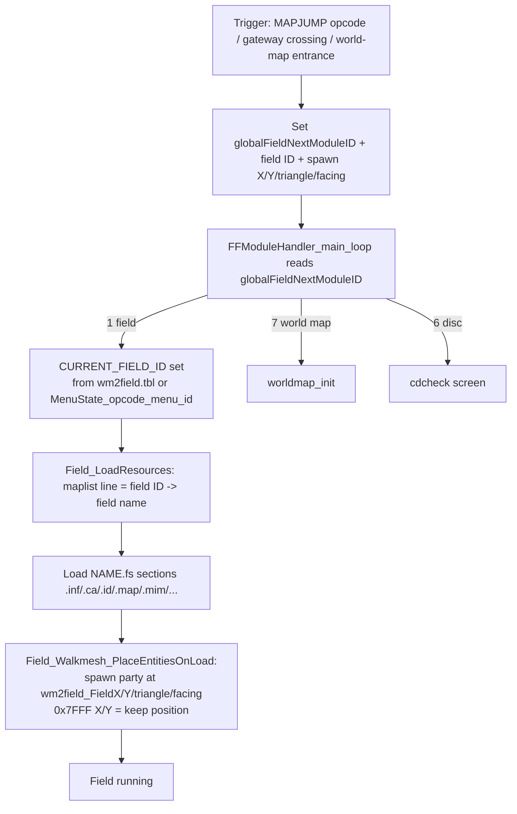

1. TOC
{:toc}

# Field jump — how the game moves between maps

The complete path that takes the party from one field to another (or to the world map / a disc change): what triggers a jump, how the destination is described, how a field ID resolves to a filename, and how the party is placed on arrival. Addresses for FF8_EN.exe, image base 0x400000. The field runtime that consumes the loaded files is on [Field rendering and collision]({{ site.baseurl }}/technical-reference/field/rendering-collision/).

## Jump request globals

Every jump, whatever triggered it, fills the same handful of globals and lets the module handler act on them:

| Global | Address | Meaning |
|--------|---------|---------|
| `globalFieldNextModuleID` | see table below | Destination module: **1** = field, **6** = disc change (cdcheck), **7** = world map, **4** = intro/credits |
| `MenuState_opcode_menu_id` | — | Multi-purpose "next module parameter"; for a field jump = **destination field ID** |
| `wm2field_FieldX` / `FieldY` | see table below | Spawn X/Y on the destination field (0x7FFF = keep current position) |
| `wm2field_FieldZ` | — | Destination walkmesh triangle / Z |
| `wm2field_FieldTarget` | — | Facing direction on arrival |

## Triggers

### Field script opcodes

Field scripts pop their arguments off the entity script stack and set the globals:

| Opcode | Function | Behaviour |
|--------|----------|-----------|
| `MAPJUMP` | 0x521A20 | Jump to field ID with spawn X, Y, triangle (arg) and facing |
| `MAPJUMP0` | 0x521C30 | Jump keeping the party's current position (X=Y=0x7FFF), target 0 |
| `MAPJUMP3` | 0x521AC0 | Like MAPJUMP with an extra parameter word |
| `WORLDMAPJUMP` | 0x521820 | Sets `globalFieldNextModuleID`=7 → world map (toggles the savemap save-enable flag) |
| `DISCJUMP` | 0x521B70 | Sets `globalFieldNextModuleID`=6 → disc-change screen, disables the menu |

### Gateways (walked field exits)

`Field_Collision_CheckGatewayCrossing` tests the 12 gateway records in the `.inf` file (`.inf`+100, 32 bytes each). A gateway fires when the player is within touch radius of its line **and** the cross-product sign against the line flips between the previous and current position. On firing it sets the same globals from the record: destination field ID (`< 0x48` routes to the world map = module 7, otherwise a field = module 1), spawn X/Y, triangle and facing. See the gateway record layout on the rendering/collision page.

### World map → field

Boarding an entrance on the world map calls `World_FindFieldEntrance`, whose returned index selects a record in **`wm2field.tbl`**. The module handler (`FFModuleHandler_main_loop`) reads that record to fill `CURRENT_FIELD_ID` + spawn globals, then enters the field.

## wm2field.tbl record format

`wm2field.tbl` is an array of **24-byte records** indexed by entrance ID:

| Offset | Size | Field |
|--------|------|-------|
| +0 | u16 | spawn X |
| +2 | u16 | spawn Y |
| +4 | u16 | walkmesh triangle / Z |
| +6 | u16 | **destination field ID** |
| +8 | u8 | facing direction |

(The table is loaded near the module handler; the same 24-byte stride is used by the world-map field-entrance path.)

## Field ID → filename: the maplist

`Field_LoadResources` resolves the numeric field ID to a field name through **`mapdata\maplist`** — a plain newline-separated text file, one field name per line:

> **A field's ID is simply its 0-based line number in `maplist`.**

The loader (part of `Field_LoadResources`) reads maplist into a buffer and walks it: it skips control characters (`< 16`, i.e. CR/LF) between lines, counting lines until the count equals `CURRENT_FIELD_ID`, then copies that line's printable characters (`> 16`) as `CURRENT_FIELD_NAME`. That name builds the field archive path and each section file is loaded:

`.inf` (gateways/triggers) · `.ca` (camera) · `.id` (walkmesh) · `.map` + `.mim` (background) · `.msk` (movie mask) · `.rat` / `.mrt` (encounter) · `.msd` (dialog) · `.gsm` / `.sfx` (sound) · `.pmd` (particles) · `.jsm` (scripts) · `.pcb` (extra).

## Where the field ID comes from

`CURRENT_FIELD_ID` is set from different sources depending on the trigger:

* **World → field**: the `wm2field.tbl` record's field-ID word (in `FFModuleHandler_main_loop`).
* **Field → field / disc jump**: `MenuState_opcode_menu_id`, which the jump opcode set (copied to `CURRENT_FIELD_ID` on field re-entry; the disc path copies it in `FFModuleHandler_main_loop` after the disc check).
* A few hardcoded returns exist (e.g. field 0x4B on a specific game-over return).

## End-to-end flow

## Function addresses

| Function | Address | Description |
|---|---|---|
| `Field_Collision_CheckGatewayCrossing` | 0x477980 | Gateway line-crossing test |
| `SCRIPT_MAPJUMP` | 0x521A20 | MAPJUMP field-script opcode |
| `SCRIPT_MAPJUMP0` | 0x521C30 | MAPJUMP0 field-script opcode |
| `SCRIPT_MAPJUMP3` | 0x521AC0 | MAPJUMP3 field-script opcode |
| `SCRIPT_WORLDMAPJUMP` | 0x521820 | WORLDMAPJUMP field-script opcode |
| `SCRIPT_DISCJUMP` | 0x521B70 | DISCJUMP field-script opcode (renamed from `DISCJUMP` in the community IDB) |
| `FFModuleHandler_main_loop` | 0x4706B0 | Module switch handler (also resolves `wm2field.tbl` records and copies `CURRENT_FIELD_ID`) |
| `Field_LoadResources` | 0x471010 | Resolves field ID to name via maplist and loads field archive sections |
| `Field_Walkmesh_PlaceEntitiesOnLoad` | 0x477C90 | Spawns entities at the destination triangle |
| `jumpFromWorldmapToField` | 0x52BC00 | World-map-to-field jump handler |
| `globalFieldNextModuleID` | 0x1CE4760 | Global variable/data, not a function — destination module id |
| `CURRENT_FIELD_ID` | 0x1CD2FC0 | Global variable/data, not a function — active field ID |
| `CURRENT_FIELD_NAME` | 0x1CD2DB0 | Global variable/data, not a function — active field name |
| `wm2field_FieldX` | 0x1CE4764 | Global variable/data, not a function — spawn X on destination field |

Addresses are for FF8_EN.exe (2000 PC release) as mapped in IDA (image base 0x400000).
