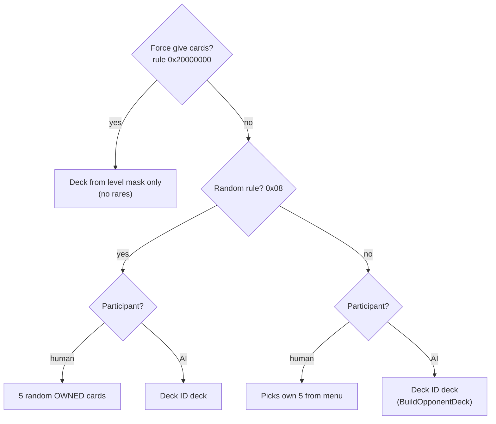
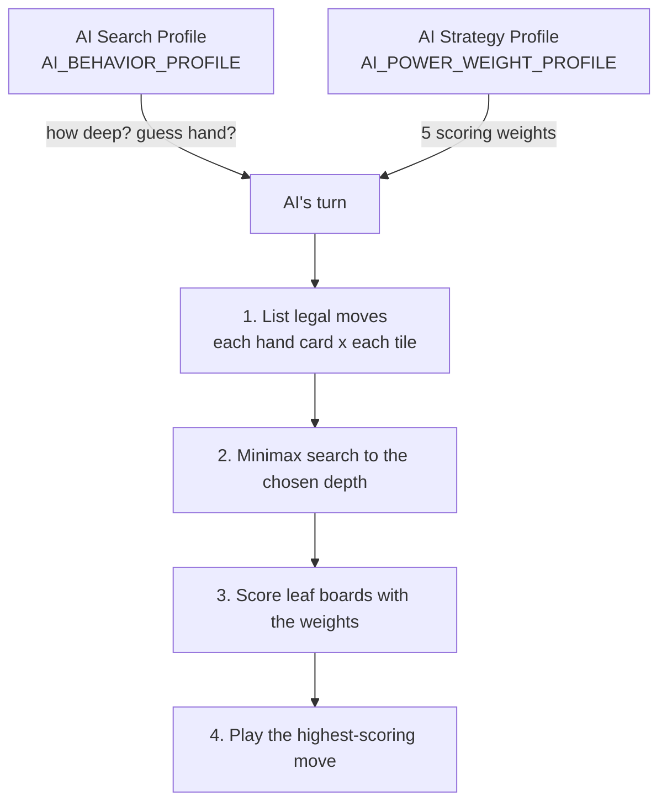
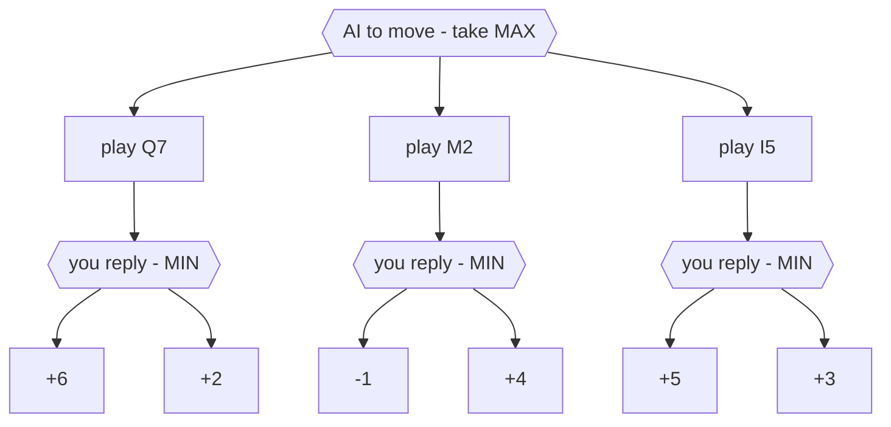

- Opcode: **0x13A**
- Short name: **CARDGAME**
- Long name: Card Game

#### Argument

none

#### Stack

The opcode pops **7 bytes** off the script stack (one byte each, last pushed is
popped first) into engine globals, then starts the match. Some entries are pushed
as Long in scripts, but only the low byte of each is actually consumed.

| Order popped | Name                       | Description             |
|--------------|----------------------------|-------------------------|
| 1            | `ALLOWED_CARD_LEVEL_MASK`  | Allowed card level mask |
| 2            | `AI_POWER_WEIGHT_PROFILE`  | AI Strategy Profile     |
| 3            | `AI_BEHAVIOR_PROFILE`      | AI Search Profile       |
| 4            | `RARE_CARD_CHANCE`         | Rare card chance        |
| 5            | `CARD_TRADES_RULES_SCRIPT` | Trade rules             |
| 6            | `CARD_GAME_RULES_SCRIPT`   | Game rules              |
| 7            | `CARD_DECK_ID`             | Deck ID                 |

Push order in the script (first pushed = Deck ID):

```
push  Deck ID
push  Game rules             (typically the region's stored rules — see below)
push  Trade rules            (typically the region's stored trade rule)
push  Rare card chance
push  AI Search Profile
push  AI Strategy Profile
push  Allowed card level mask
CARDGAME
```

**CARDGAME**

#### Description

Starts a game of Triple Triad against the specified deck.

There should be a copy of the **"cardgamemaster"** entity on the scene to handle
all this — call `[region]_maeshori0` before the game (it prepares the opponent and
loads the region's rules from the save-map), then run **CARDGAME**, and finally
call `[region]_shori0` afterwards to deal with the result.

Internally, `SCRIPT_CARDGAME` copies the 7 bytes into engine globals.
When the card module actually boots (in `FFBattleDirector_battleLoop`) it copies
`CARD_GAME_RULES_SCRIPT` → `CARD_GAME_RULES` and `CARD_TRADES_RULES_SCRIPT` →
`CARD_TRADE_RULES_ENGINE`, decides who controls each side, and builds the decks.

{: .important }
The opcode returns the number of cards you currently own and only starts the game
if you own **5 or more** cards.

---

#### Game rules

[*Game rules*]({{ site.baseurl }}/technical-reference/list/card-list#game-rules)
(`CARD_GAME_RULES_SCRIPT`, enum `CardGameRulesFlag`) is a bitfield. The opcode can
only set the **low byte** — the 7 real Triple Triad rules. The three high
control-mode bits exist in the engine but are set by other systems (the
cardgamemaster entity / debug), not by this opcode.

| Bit          | Rule                             | Notes                                                                   |
|--------------|----------------------------------|-------------------------------------------------------------------------|
| `0x00000001` | **Open**                         | Both hands shown; the AI also stops guessing the hidden hand            |
| `0x00000002` | **Same**                         |                                                                         |
| `0x00000004` | **Plus**                         |                                                                         |
| `0x00000008` | **Random**                       | Hand becomes 5 random cards from the collection                         |
| `0x00000010` | **Sudden Death**                 |                                                                         |
| `0x00000020` | *(unused)*                       | Not referenced anywhere                                                 |
| `0x00000040` | **Wall**                         | Need **Same** (`0x02`) to get Same Wall rule                            |
| `0x00000080` | **Elemental**                    |                                                                         |
| `0x20000000` | **Force give cards**             | Opponent deck built with no rares; cards handed over at end (no-stakes) |
| `0x40000000` | **Both sides AI controlled**     | Demo/auto-play (`PARTICIPANT_CONTROLLER_TYPE = 0x0303`)                 |
| `0x80000000` | **Both sides player controlled** | (`PARTICIPANT_CONTROLLER_TYPE = 0x0202`)                                |

With no control bits set, the game is player vs AI (`0x0203`).

#### Trade rules

[*Trade rules*]({{ site.baseurl }}/technical-reference/list/card-list#trade-rules)
(`CARD_TRADES_RULES_SCRIPT`, enum `CardTradeRule`) decides how cards change hands
at the end of the match:

| Value | Rule           | Effect                                                                |
|-------|----------------|-----------------------------------------------------------------------|
| `0`   | **None**       | No trade — each player keeps their own cards (also the draw fallback) |
| `1`   | **One**        | Winner takes 1 card                                                   |
| `2`   | **Difference** | Winner takes `2 × captured − 10` cards (the score difference)         |
| `3`   | **Direct**     | Each player keeps every card they captured on the board               |
| `4`   | **All**        | Winner takes all 5                                                    |

{: .note }
The **Game rules** and **Trade rules** arguments are normally *not* hard-coded:
the `[region]_maeshori0` script reads the region's current ruleset from the
save-map card-game block (variables **272–299**; see
[Variables]({{ site.baseurl }}/technical-reference/miscellaneous/variables)) and
passes those two bytes in — which is why the rules reflect whatever the Queen of
Cards has spread or abolished. The old page cited vars **292 / 293** for this. A
mod can instead push a literal rules/trade value to force a fixed ruleset.

#### Rare card chance

Each rare card whose current location equals the challenge's **Deck ID** has a
`RARE_CARD_CHANCE / 100` probability of being added to the NPC's deck (up to 5
rares). The chance is **halved** after every successful pick, so additional rares
in the same hand become progressively less likely.

- Rare cards are card IDs **77–109** (33 cards: the GF / boss / special cards).
- A card is eligible only if its current owner-location matches the Deck ID.
- `RARE_CARD_CHANCE = 0` → never; `100` → first rare guaranteed, then 50 %, 25 %…

#### Deck ID (owner location)

The **Deck ID** is a location/owner code. It (a) is the deck the AI opponent draws
from and (b) gates which rare cards can appear (see above). The reserved value
`0xF0` means "the player's own cards". Rare-card locations are **savegame state**
(cards move around as you play), not a fixed table.

#### Allowed card level mask

A 7-bit mask (`ALLOWED_CARD_LEVEL_MASK`, bits 0–6) that selects which card levels
the generated deck may pick from. For example `0x0A` allows level 2 and level 4.
Each level is a contiguous group of 11 card IDs:

| Bit    | Level | Card IDs |
|--------|-------|----------|
| `0x01` | Lv 1  | 0–10     |
| `0x02` | Lv 2  | 11–21    |
| `0x04` | Lv 3  | 22–32    |
| `0x08` | Lv 4  | 33–43    |
| `0x10` | Lv 5  | 44–54    |
| `0x20` | Lv 6  | 55–65    |
| `0x40` | Lv 7  | 66–76    |

Deck-building details:

- For each non-rare slot: pick a random enabled level, `card = 11×level + rand%11`.
- Card ID **47** is explicitly excluded (re-rolled).
- Duplicates within the same hand are re-rolled.
- If the mask is `0`, it defaults to level 1 only.

#### Deck-source logic (per participant)

Which hand each participant receives (decided in `sub_537110`):



Controller type comes from the Game-rules high bits: default `0x0203`
(P0 = AI, P1 = human), Both-AI `0x0303`, Both-player `0x0202`
(controller value 2 = human, 3 = AI).

---

## How the NPC plays — the Triple Triad AI

Two of the bytes control the computer opponent, and they are independent knobs:

| Wiki name               | Engine global             | Controls                                                                     |
|-------------------------|---------------------------|------------------------------------------------------------------------------|
| **AI Search Profile**   | `AI_BEHAVIOR_PROFILE`     | *How hard it thinks* — look-ahead depth + whether it models your hidden hand |
| **AI Strategy Profile** | `AI_POWER_WEIGHT_PROFILE` | *What it wants* — how it scores a board (5 weights)                          |

These two are usually hard-coded constants in the calling script (each NPC has a
fixed difficulty), unlike the rules, which are read from the region's save-map
state.



Think of it as **effort × taste**: the Search Profile decides *how far ahead* it
looks, the Strategy Profile decides *what a good position looks like*.

### A quick primer: what is minimax?

Minimax is the classic algorithm for two-player, turn-based games. It assumes
**both players play to win**, and looks a few moves ahead to find the move that is
best *even after the opponent replies as well as they can*.

- On **its own turn** the AI takes the move with the **highest** score → **MAX**.
- On **your turn** it assumes you take the move that is **worst for it** → **MIN**.

It builds a small tree of "what if I play here, then they play there, then I…",
scores the boards at the bottom, and bubbles the values back up — max at its own
levels, min at yours.







Each branch is worth the **minimum** of its leaves (your best reply):
`Q7 → +2`, `M2 → -1`, `I5 → +3`. The AI then takes the **maximum**: `+3` → it
plays **I5**. Note Q7's tempting `+6` is ignored, because you would just answer
with the `+2` line — that "assume the opponent is smart" step is what makes
minimax strong.

**Depth** is how many half-moves (plies) it looks ahead before scoring:

- depth **1** = greedy: score right after its own move, ignore your reply
- depth **2** = its move + your best reply
- depth **3–4** = its move + your reply + its counter (+ your counter)

### AI Search Profile (`AI_BEHAVIOR_PROFILE`)

#### 1) Look-ahead depth — low 3 bits (`profile & 7`, 0–7)

The low 3 bits pick a **row** in an internal table
(`CARD_AI_SEARCH_DEPTH_TABLE`); the looked-up value is the minimax
**search depth**. The **column** is `valid_outcome_count`, computed once when the
AI's move-decision task is built (`PrepareAIMoveDecisionTask`): it starts at **9**
and is decremented for every *empty* slot across **both players' hands**, so it
tracks how many cards are still left to play (it shrinks as the game goes on) —
*not* the number of moves open on the board. The net effect is still that the
search is shallow early (hands full, too many branches to afford) and deeper in
the mid/endgame. Index = `9 × (profile & 7) + valid_outcome_count`:

| profile | c0 | c1 | c2 | c3 | c4 | c5 | c6 | c7 | c8 |
|---------|----|----|----|----|----|----|----|----|----|
| 0       | 0  | 1  | 1  | 1  | 1  | 1  | 1  | 1  | 1  |
| 1       | 1  | 1  | 2  | 2  | 2  | 1  | 1  | 1  | 1  |
| 2       | 1  | 1  | 2  | 2  | 2  | 2  | 2  | 2  | 2  |
| 3       | 2  | 1  | 2  | 3  | 3  | 3  | 2  | 2  | 2  |
| 4       | 2  | 1  | 2  | 3  | 3  | 3  | 3  | 3  | 2  |
| 5       | 2  | 1  | 2  | 3  | 4  | 3  | 3  | 3  | 2  |
| 6       | 2  | 1  | 2  | 3  | 4  | 4  | 3  | 3  | 3  |
| 7       | 3  | 1  | 2  | 3  | 4  | 4  | 4  | 4  | 3  |

Higher profile ⇒ uniformly deeper search ⇒ stronger play. Profile **0** searches
~1 ply almost everywhere (plays greedily/instantly); profile **7** reads 3–4 plies
deep in the mid-game.

#### 2) Hidden-hand handling — bit `0x10`

You normally can't see the opponent's hand, so the AI has to decide what to assume
about *your* cards during its look-ahead:

- **bit clear** (and not the Open rule): the AI **invents a plausible hand for
  you** — random cards sized to your deck level — and plays around threats you
  *might* hold → more cautious and realistic.
- **bit set** (or the Open rule is active): the AI **does not guess** — it only
  reasons about cards it can actually see.

So `profile & 7` = *how deep it thinks*, `profile & 0x10` = *whether it models your
hidden cards*.

### AI Strategy Profile (`AI_POWER_WEIGHT_PROFILE`)

`profile & 7` (0–7) selects one of 8 weight presets from
`AI_POWER_WEIGHT_PROFILE_ARRAY` (`CardAIPowerWeightProfile`). Those
weights are the only tunable inputs to the board **scoring function** the minimax
uses at its leaves (`EvaluateBoardScore`). Everything is scored **from
the AI's point of view** (positive = good for the AI):

```
score = 0

# board - the 9 tiles
for each occupied tile:
    strength   = POWER_WEIGHT[card]                 # scaled card power (see below)
    tile_value = TILE_BASE_VALUE + strength
    if the AI owns the tile:   score += tile_value
    else (you own it):         score -= tile_value

# the AI's own remaining hand - 5 slots
for each card still in the AI's hand:
    score += HAND_VALUE_SCALE * POWER_WEIGHT[card]

# noise
if RANDOMNESS > 0:
    score += random(0 .. RANDOMNESS)
```

`POWER_WEIGHT[card]` is precomputed once per game as
`(card_power_scale × card_power / 200) >> 12` (the `>> 12` un-scales the
fixed-point weight, where `1.0 = 4096`; `card_power` is the card's top-edge stat).
If `card_power_scale = 0`, **every card's strength becomes 0** and the AI scores
purely by *how many tiles it holds*.

One extra weight lives inside the minimax itself: leaf scores reached on the
**AI's own move** are multiplied by `self_turn_score_scale` (your-turn nodes use ×1).

**What each weight does:**

| Weight (field name)        | Raising it makes the AI…                                                                     |
|----------------------------|----------------------------------------------------------------------------------------------|
| `tile_occupied_base_value` | value **territory** — every controlled tile counts, regardless of the card on it             |
| `card_power_scale`         | care about **card strength** (0 = treats all cards as equal)                                 |
| `hand_card_value_scale`    | **hoard** — value cards still in hand, so it's reluctant to spend its good ones              |
| `self_turn_score_scale`    | be **greedy/impatient** — over-value gains it makes on its *own* move (grab the capture now) |
| `evaluation_randomness`    | be **unpredictable** — occasionally pick a slightly worse move                               |

**The 8 presets** (fixed-point, 1.0 = neutral):

| idx       | tile | power   | random  | self-turn | hand    | Character                                                                                            |
|-----------|------|---------|---------|-----------|---------|------------------------------------------------------------------------------------------------------|
| 0 / 6 / 7 | 1.0  | 0       | 0       | 1.0       | 1.0     | Ignores card strength → pure **territory control**, all cards equal. Simple/weak, predictable.       |
| 1         | 0.5  | 1.0     | 0       | 1.0       | **4.0** | **Hoards strong cards** — huge value on cards kept in hand; cares little about tiles. Defensive.     |
| 2         | 1.0  | **4.0** | 0       | 1.0       | 0.5     | **Power-hungry** — wants strong cards on the board, plays and defends its heavy hitters. Aggressive. |
| 3         | 1.0  | 0       | **1.0** | 1.0       | 1.0     | Territory play **with noise** → unpredictable.                                                       |
| 4         | 1.0  | 0       | 0       | **2.0**   | 1.0     | **Greedy** — over-weights its own captures.                                                          |
| 5         | 1.0  | 0       | 0       | **4.0**   | 1.0     | **Very greedy** — extreme version of 4.                                                              |

#### Worked example

Say strong cards are worth `5`, weak cards `1`, and each owned tile has a base of
`1`. After some move the board looks like this (A = the AI, B = you):

```
        col0        col1        col2
      +---------+---------+---------+
 row0 | A  D5   | B  .1   |  empty  |
      +---------+---------+---------+
 row1 | A  .1   |  empty  | B  D5   |
      +---------+---------+---------+
 row2 |  empty  | A  .1   |  empty  |
      +---------+---------+---------+
        D = strong (5)   . = weak (1)   base = 1 per owned tile
```

- A owns 3 tiles: `(1+5) + (1+1) + (1+1)` = **10**
- B owns 2 tiles: `(1+1) + (1+5)` = **8**
- board score = `10 − 8` = **+2** (plus the hand term for A's unplayed cards)

How the **Strategy Profile** changes the same board:

- **Preset 0** (`card_power_scale = 0`): strengths vanish → `3 owned − 2 owned = +1`.
  The AI **doesn't even notice** you parked a strong card on `row1/col2`.
- **Preset 2** (`card_power_scale ×4`): that strong B tile becomes a big negative →
  the AI **fights hard** to flip power tiles and plant its own strong cards.
- **Preset 1** (`hand_card_value_scale ×4`): the hand term dominates → the AI
  **leads with weak cards and hoards its aces**, even at the cost of the board.

### Personalities — example opponents

| Nickname            | Search | Strategy | How it feels to play against                                                                                                                           |
|---------------------|--------|----------|--------------------------------------------------------------------------------------------------------------------------------------------------------|
| **The Beginner**    | 0      | 0        | ~1-ply greedy, counts tiles only, guesses your hand at random. Grabs whatever flips the most squares *right now*; ignores card strength; easy to bait. |
| **The Hoarder**     | 3      | 1        | Refuses to spend its best cards — opens with junk and clings to its aces. You can out-tempo it because it plays sub-optimally to protect cards.        |
| **The Bruiser**     | 3      | 2        | Slaps its strongest cards down and bullies the board. Aggressive but readable; vulnerable to Same/Plus combos and to being out-positioned.             |
| **The Gambler**     | 4      | 5        | Impatient — always takes the immediate capture, even when a patient move is better. Predictable → set a bait tile and punish.                          |
| **The Wildcard**    | 4      | 3        | Solid but noisy; the randomness makes it misplay now and then.                                                                                         |
| **The Grandmaster** | 7      | 2 (or 5) | Reads 3–4 plies deep, doesn't need to guess your hand, and wants a coherent, powerful board. A genuinely hard fight — save your combos for the end.    |

The two knobs are orthogonal:

|                    | Strategy: territory / weak                       | Strategy: power / greedy                                          |
|--------------------|--------------------------------------------------|-------------------------------------------------------------------|
| **Search shallow** | `0,0` Beginner (harmless)                        | `0,2` strong-but-blind (grabs power, no plan)                     |
| **Search deep**    | `7,0` deep-but-aimless (thinks hard, wrong goal) | `7,2` / `7,5` Grandmaster (thinks hard AND wants the right thing) |

The strongest opponents are **high Search + a coherent Strategy**.

### Hard-coded search limits (advanced)

Two fixed numbers cap how much the AI is allowed to think, no matter which profiles
it was given. They are the same for every opponent in the game, and both can be
changed by patching — the exact code addresses and byte patterns are in the
[Reference](#reference-addresses) section at the bottom.

To understand them you need one fact: **the AI thinks across several game frames, a
little at a time.** A deep search done all in one go would freeze the screen, so
while it is the AI's turn the card module runs a small "pick a move" task **once per
frame**. Each frame does one slice of the search and then hands control back so the
game keeps running smoothly.

- **100 — positions per frame.** At the start of every frame this counter is reset
  to 100. It counts *hypothetical placements*: each time the search asks "what if I
  put this card on that empty tile?", it simulates that board and spends one. When
  it reaches 0 the slice stops immediately — even in the middle of the look-ahead —
  and the game moves on to the next frame. This exists only so that a single frame
  never does too much work at once.
- **10 — frames per move.** How many of those per-frame slices the AI may use to
  settle on one move. The half-finished search is remembered between frames, so the
  AI resumes where it left off; across the slices it can examine roughly
  `10 × 100 = 1000` positions in total. Any slices it doesn't need (because the
  search finished early) become a short "thinking" pause before it actually plays.

Together these are the real ceiling on the AI's strength: the depth table can *ask*
for a deep search, but if that search would need more than ~1000 positions it never
finishes, and the AI simply plays the best move it found so far.

| Number | What it limits                                                     |
|--------|--------------------------------------------------------------------|
| 100    | Hypothetical placements the AI may test in a single frame          |
| 10     | Frames the AI may spend on one move (unused frames become a pause) |

{: .note }
Raising **100** lets each frame do more work, so deeper searches finish (stronger,
but each frame costs more time). Raising **10** gives the AI more frames per move
(stronger, but it pauses a little longer before playing). Both apply to every card
match at once.

---

#### Reference (addresses)

Script-input globals (the 7 bytes the opcode writes):

| Symbol                                          | Address   |
|-------------------------------------------------|-----------|
| `ALLOWED_CARD_LEVEL_MASK`                       | 0x1DCD7B0 |
| `AI_POWER_WEIGHT_PROFILE` (AI Strategy Profile) | 0x1DCD7AE |
| `AI_BEHAVIOR_PROFILE` (AI Search Profile)       | 0x1DCD7AF |
| `RARE_CARD_CHANCE`                              | 0x1DCD7B1 |
| `CARD_TRADES_RULES_SCRIPT`                      | 0x1DCD7AC |
| `CARD_GAME_RULES_SCRIPT`                        | 0x1DCD7A8 |
| `CARD_DECK_ID` (Deck ID)                        | 0x1DCD7AD |

Functions and engine internals:

| Symbol                                                                 | Address   |
|------------------------------------------------------------------------|-----------|
| `SCRIPT_CARDGAME`                                                      | 0x5225A0  |
| `BuildOpponentDeck`                                                    | 0x537640  |
| `PrepareAIMoveDecisionTask`                                            | 0x53ADF0  |
| `ExecuteAIMoveSelectionTask`                                           | 0x53AFA0  |
| `SearchBestMoveMinimax`                                                | 0x53B170  |
| `EvaluateBoardScore`                                                   | 0x53B430  |
| `RunCardMatchTurnLoop` (trade resolution)                              | 0x534BC0  |
| `AI_POWER_WEIGHT_PROFILE_ARRAY`                                        | 0xC75BF8  |
| `CARD_AI_SEARCH_DEPTH_TABLE` (search-depth table)                      | 0xC75BAF  |
| `CARD_AI_SEARCH_POSITION_BUDGET` (positions per frame = 100)           | 0x1DFF3F4 |
| `CARD_AI_MOVE_FRAME_BUDGET` (frames per move = 10)                     | 0x1DFF394 |
| `CARD_AI_SEARCH_NODE_STACK` (minimax per-ply node stack; root at base) | 0x1DFF2B8 |
| `CARD_AI_BOARD_STATE` (live board the AI search reads/copies)          | 0x1DFF010 |
| `CARD_GAME_RULES` (live)                                               | 0x1DCD794 |
| `CARD_TRADE_RULES_ENGINE` (live)                                       | 0x1DCD766 |

Patch points for the two hard-coded search limits (image base `0x400000`):

| Constant                         | Value | Set by instruction                                        | Immediate to patch       |
|----------------------------------|-------|-----------------------------------------------------------|--------------------------|
| `CARD_AI_SEARCH_POSITION_BUDGET` | 100   | `mov …, 100` @ 0x53B055 (`C7 05 F4 F3 DF 01 64 00 00 00`) | `64 00 00 00` @ 0x53B05B |
| `CARD_AI_MOVE_FRAME_BUDGET`      | 10    | `mov …, 10` @ 0x53B0A9 (`C7 05 94 F3 DF 01 0A 00 00 00`)  | `0A 00 00 00` @ 0x53B0AF |
