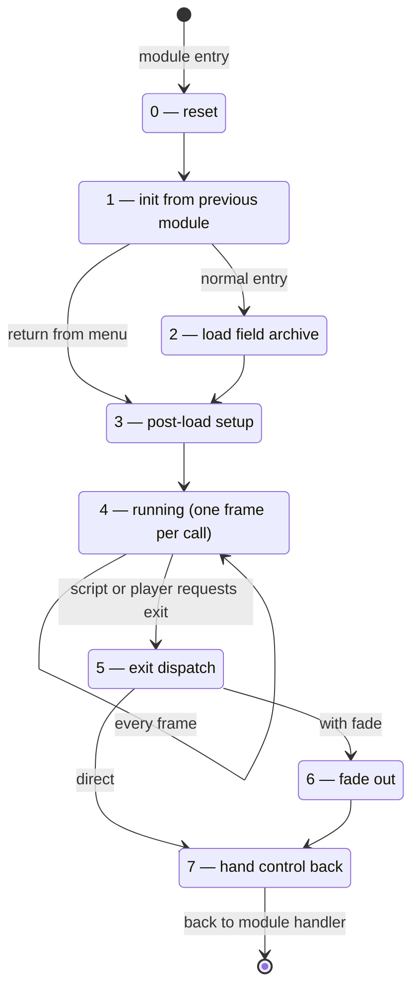

1. TOC
{:toc}

# Field module runtime

This page describes how the field module executes at runtime: the field director state machine, the per-frame pipeline, the walkmesh, the entity classes and the field script virtual machine. For the on-disk formats see [Field File Format]({{ site.baseurl }}/technical-reference/field/field-file-format/), and for the script instruction set see [Field Opcodes]({{ site.baseurl }}/technical-reference/field/field-opcodes/). How the engine enters and leaves the field module is covered in [Engine startup and main loop]({{ site.baseurl }}/technical-reference/main/engine-startup-and-main-loop/).

## Module lifecycle

The field module is registered by the game module handler with three callbacks: an init (`field_init`) that sets the data path, the 30.5 fps frame rate and the render viewport (320×224 internal, 640×448 in high resolution), a per-frame main loop (`FFFieldModule_field_main_loop`), and an exit callback (`FFFieldExitSystem`).

The main loop clears and presents the frame, and delegates all game logic to the **field director** (`FFFieldDirector`), a state machine on the `FIELD_FLOW` global:

* **State 1** resets movie/ladder/menu bytes when the engine comes from field, world map or battle (`ENGINE_STATE` ≤ 2), initializes the overlay draw lists on a fresh entry, and installs the twelve field-section pointer slots (see below). If the engine comes back from the menu it skips straight to state 3.
* **State 2** calls `Field_LoadResources`, which reads the field archive and fills the section pointers.
* **State 3** rebuilds the draw lists, computes the camera center from the `.inf` bounds, derives the walkmesh pointers from the `.id` section, resets `globalFieldNextModuleID`, and selects the music transition according to the module the engine came from.
* **State 4** runs the actual field frame (see pipeline below).
* **State 5** dispatches on `globalFieldNextModuleID` — the "where to go next" register that scripts and the engine write:

| `globalFieldNextModuleID` | Destination |
|---------------------------|-------------|
| 1 | Another field (field ID from `MenuState_opcode_menu_id`, with special texture handling when leaving/entering field 285) |
| 3 | Battle (with fade, `FIELD_FLOW` = 7) |
| 4 | Title screen reset |
| 5, 6 | Menu (with fade) |
| 7 | World map (`mode_StateGlobal` = 2, position handed over through `wanted_game_mode`) |
| 8 | Card game (with fade) |

* **State 7** raises the module-done flag (`dword_1CE4A68`); the main loop then switches back to `FFModuleHandler_main_loop`.

A CD-check interlude runs before all of this whenever the disc number stored in the savemap does not match the detected disc.

## Per-frame pipeline (state 4)

Each frame, `FFFieldDirector` state 4 executes in order:

1. **Script VM** — `field_script_vm_run_frame` (see below), called from the frame updater with the current draw buffer.
2. **Input** — pad/keyboard state is polled into current/previous bitmasks (`dword_1CE48A0/A4`); the reset combination forces a title-screen exit; the menu button opens the menu (saving the party position for the return).
3. **Camera** — `Call_Bs_parseCamera2` re-reads the camera from the `.ca` section (or from the movie camera while an FMV plays).
4. **Entity motion** — `field_update_entities_motion`: analog/digital movement of the player (walk/run speed, run disable, footstep bookkeeping), scripted motion interpolation, jumps (parabolic, `.id` triangle targeted) and ladders for every character entity.
5. **Talk/examine check** — `field_check_talk_interaction`: on button press, finds the closest facing entity within its talk radius and raises its talk-request flag.
6. **Background & rendering** — background tile animation, character model rendering, the `.msk` depth mask when a movie plays, particle (`.pmd`/`.pmp`) updates, draw-list finalization.
7. **Gateway check** — the player position is tested against the `.inf` gateways (door rectangles) to trigger field jumps.
8. **Game-over hook** — when savemap `miscFlag` bit 0x40 is set (and no countdown is active), the director forces a field jump to field 75, the game-over field. This is the same flag the battle handler sets when the party is defeated.

Movement is resolved against the **walkmesh** from the `.id` section: 24-byte triangles (`FIELD_WALKMESH_TRIANGLES`), a per-triangle table of the three edge neighbors (`FIELD_WALKMESH_ADJACENCY`, −1 = wall), and a 512-bit runtime bitfield (`FIELD_WALKMESH_BLOCKED_BITS`) that scripts use to close individual crossings (ID/gateway locks). `walkmesh_resolve_movement` slides the actor along blocked edges and walks the adjacency graph when a passable edge is crossed.

## Field memory layout and section loading

All field data lives in one big buffer whose base is stored in `off_B6D06C`. Its first **11 dwords are section-pointer slots**; the data pool follows at offset +44 and grows through a bump allocator (`FIELD_MEMORY_POOLING`). The director publishes the *addresses* of the slots into individual globals (state 1), and `Field_LoadResources` (state 2) allocates each section from the pool and writes the resulting pointer into the slot:

| Slot | Section | Published slot address | Notes |
|------|---------|------------------------|-------|
| 0 | .inf | `INFO_DATA_POINTER_INF_FILE` | Data pointer also copied to `FIELD_INF_DATA_PTR` (gateways, camera bounds, flags) |
| 1 | .ca | `CHARACTER_DATA_POINTER_CA_FILE` | Camera data |
| 2 | .id | `WALKMESH_DATA_POINTER_ID_FILE` | Walkmesh |
| 3 | .map | `MAP_DATA_POINTER_MAP_FILE` | Background tiles |
| 4 | .msk | `FIELD_MSK_PTR_SLOT_ADDR` | Movie depth mask, only loaded when the field has one |
| 5 | .rat | `FIELD_RAT_PTR_SLOT_ADDR` | Battle encounter rate |
| 6 | .mrt | `FIELD_MRT_PTR_SLOT_ADDR` | Battle encounter groups |
| 7, 9, 10 | — | `FIELD_SLOT*_ADDR_UNUSED` | Written by the director, never filled or read (PSX leftovers) |
| 8 | — | `FIELD_MSD_TEXT_PTR` | The director points it at slot 8, but the loader overwrites the global with the .msd data pointer directly |

The remaining sections bypass the slot array and go to dedicated globals, in load order:

| Section | Destination | Notes |
|---------|-------------|-------|
| `mapdata\maplist` | `byte_19FB118` | Field name list, loaded once |
| .mim | staging buffer → VRAM | Background textures (`load_field_background_textures`) |
| .pmp / .pvp | staging buffer → VRAM | Extra texture pages + palette; merged unless .pmp is the 4-byte placeholder |
| .msd | `FIELD_MSD_TEXT_PTR` (+ copy `FIELD_MSD_TEXT_PTR_COPY`) | Dialogue text |
| .gsm | `FIELD_GSM_DATA_PTR` | |
| .sfx | `SFX_DATA` (static buffer) | Entry count = file size / 4 → `NUMBER_SFX_IN_CURRENT_FIELD` |
| .pmd | `FIELD_PMD_PARTICLE_DATA_PTR` | 24356 bytes reserved; a 4-byte file means "no particles" (pointer set to 0) |
| .jsm | `POINTER_JSM_LOADED_DATA` | Scripts; `jumpFromWorldmapToField` then parses it and builds the entity arrays |
| .pcb | pool (transient) | Consumed together with `chara.one` |
| `chara.one` | model instances (`CHARA_DATA_STRUCTURE`…) | `Field_CharaOne`; .inf byte +13 selects the main-character model table instead of the NPC one |

A 4-byte file is the archive's "section absent" placeholder — the loader tests for load size 4 in several places (.pmp, .pmd).

## Entity classes

The script system drives four arrays of entities, all sharing the same script-execution header:

| Class | Element size | Count / pointer | Role |
|-------|-------------|-----------------|------|
| Character entities | 612 bytes | `CHARA612_ENTITY_COUNT` / `CHARA_FIELD_ENTITY612_PTR` | Actors with a 3D model: position, walkmesh triangle, animation state, talk/push radii |
| Model-less entities | 416 bytes | `CHARA_ENTITY_416_COUNT` / `CHARA_ENTITY_416_PTR_MAYBE_NPC` | Script entities without a model (lines, triggers) |
| Object entities | — | `OBJECT_ENTITY_COUNT` / `OBJECT_ENTITY_PTR` | Background objects |
| Special entities | 436 bytes | `SPECIAL_ENTITY_COUNT` / `SPECIAL_ENTITY_PTR` | Always-running system scripts |

`FIELD_PLAYER_ENTITY_INDEX` selects which character entity is the player.

## The field script virtual machine

`field_script_vm_run_frame` runs once per field frame and executes the scripts of every entity. Before the scripts, it ticks the step-based systems:

* the savemap step counter (`Steps`) advances by the distance walked this frame;
* a status tick every 0x2800 step-units (poison-style effects on party slots);
* GF HP regeneration (+1 HP per healing period);
* SeeD salary every 0x6000 step-units, and the SeeD rank point clamp to [100, 3100];
* the field countdown timer (fires its script hook at zero);
* all of the money/salary systems are suspended in the Laguna dream sequences and when the salary is script-disabled (`miscFlag` bit).

### Execution model

Every entity owns a script context in its header: an instruction pointer (index into the decompressed `.jsm` code at `FIELD_INSTRUCTION_START`), a data stack, a priority level (`ready_bit_index`), a per-priority mask of runnable scripts, and saved instruction pointers/stack positions for each priority.

Instructions are 32-bit words. When the top byte is non-zero it is the opcode and the low 24 bits are a sign-extended parameter; otherwise the whole word is the opcode with no inline parameter (`fieldScriptInstructionDecoder`). The opcode indexes the handler table `FIELD_SCRIPT_OPCODE_TABLE`; each handler returns a flag byte:

| Bit | Meaning |
|-----|---------|
| 1 | Yield — stop executing this entity for this frame |
| 2 | Advance the instruction pointer |
| 4 | Keep the "ready" bit of the current priority |

Each entity may execute at most **16 instructions per frame**; an entity that never yields is simply cut off until the next frame. This is the budget that makes `WAIT`-less loops still let the game run.

### Event triggers and priorities

An entity's scripts live in the `.jsm` entry-point table (`FIELD_SCRIPT_ENTRYPOINT_TABLE`); the entity header stores its base index (`field_178`), and event scripts are located at fixed offsets from it (base + 2, + 3, ...: talk, push and the line events — walked across, touch, touch-on, touch-off). When the engine raises an event flag (for example the talk check described above), the VM:

1. saves the current instruction pointer and stack position into the slot of the current priority,
2. loads the event script's entry point,
3. sets the priority to the event's level (talk and the primary events preempt lower levels; a script already running at equal or higher priority blocks the event until it finishes).

This is a cooperative-preemptive coroutine system: returning from the event script (RET) restores the interrupted script from the saved slots.

## Address table

| Name | Address | Description |
|------|---------|-------------|
| `field_init_sub_46FD70` | 0x46FD70 | Module init: paths, 30.5 fps, viewport |
| `FFFieldModule_field_main_loop` | 0x46FEE0 | Module main loop (render shell around the director) |
| `FFFieldExitSystem` | 0x46FE80 | Module exit |
| `FFFieldDirector` | 0x471F70 | FIELD_FLOW state machine |
| `Field_LoadResources` | 0x471010 | Field archive loader (fills the section slots) |
| `Field_CharaOne` | 0x532A40 | chara.one model loader (see below) |
| `off_B6D06C` | 0xB6D06C | Base pointer of the field data buffer (11 slots + pool) |
| `FIELD_MEMORY_POOLING` | 0x1CE4BF8 | Bump-allocator cursor inside the field buffer |
| `FIELD_INF_DATA_PTR` | 0x1CDC744 | Loaded .inf data (gateways at +100, camera bounds at +84) |
| `FIELD_MSD_TEXT_PTR` | 0x1CE50C8 | Loaded .msd dialogue text |
| `FIELD_GSM_DATA_PTR` | 0x1CF3D7C | Loaded .gsm data |
| `FIELD_PMD_PARTICLE_DATA_PTR` | 0x1CF3D84 | Loaded .pmd particle data (0 = none) |
| `POINTER_JSM_LOADED_DATA` | 0xB6D098 | Loaded .jsm script data |
| `field_script_vm_run_frame` | 0x529FF0 | Script VM + step-based systems, once per frame |
| `fieldScriptInstructionDecoder` | 0x530760 | Splits an instruction word into opcode + 24-bit parameter |
| `field_update_entities_motion` | 0x4789A0 | Player input movement, scripted moves, jumps, ladders |
| `field_check_talk_interaction` | 0x4796E0 | Talk/examine proximity + facing check |
| `walkmesh_resolve_movement` | 0x47A3E0 | Walkmesh slide/cross movement resolution |
| `FIELD_FLOW` | 0x1CE4A64 | Director state (0–7, table above) |
| `globalFieldNextModuleID` | 0x1CE4760 | Requested field-exit destination |
| `FIELD_SCRIPT_OPCODE_TABLE` | 0xB8DE94 | Opcode handler function table |
| `FIELD_INSTRUCTION_START` | 0x1D9CF50 | Pointer to decompressed .jsm code |
| `FIELD_SCRIPT_ENTRYPOINT_TABLE` | 0x1D9D0E4 | Script entry-point table (word per script) |
| `FIELD_WALKMESH_TRIANGLES` | 0x1CF3D68 | Walkmesh triangle array (24 bytes each) |
| `FIELD_WALKMESH_ADJACENCY` | 0x1CF3D88 | 3 neighbor-triangle ids per triangle (−1 = wall) |
| `FIELD_WALKMESH_BLOCKED_BITS` | 0x1CE4918 | 512-bit runtime crossing-lock bitfield |
| `FIELD_PLAYER_ENTITY_INDEX` | 0x1CD8FD0 | Index of the player-controlled character entity |
| `CHARA_FIELD_ENTITY612_PTR` | 0x1D9CF88 | Character entity array (612 bytes each) |
| `CHARA612_ENTITY_COUNT` | 0x1D9D019 | Character entity count |
| `CHARA_ENTITY_416_PTR_MAYBE_NPC` | 0x1D9D0F0 | Model-less entity array (416 bytes each) |
| `OBJECT_ENTITY_PTR` / `OBJECT_ENTITY_COUNT` | 0x1D9CF90 / 0x1D9D0E1 | Object entities |
| `SPECIAL_ENTITY_PTR` / `SPECIAL_ENTITY_COUNT` | 0x1D9CF8C / 0x1D9D0E8 | Special entities |
| `CURRENT_FIELD_ID` | 0x1CD2FC0 | Field to load / currently loaded |
| `RAM_PREVIOUS_MAP_ID` | 0x1CE4880 | Previous field ID (for LASTIN/LASTOUT) |
| `STEP_COUNTER` | 0x1CFF6EC | Mirror of savemap Steps |

Addresses are for FF8_EN.exe (2000 PC release) as mapped in IDA (image base 0x400000). Field 74 is the new-game start field and field 75 the game-over field.
