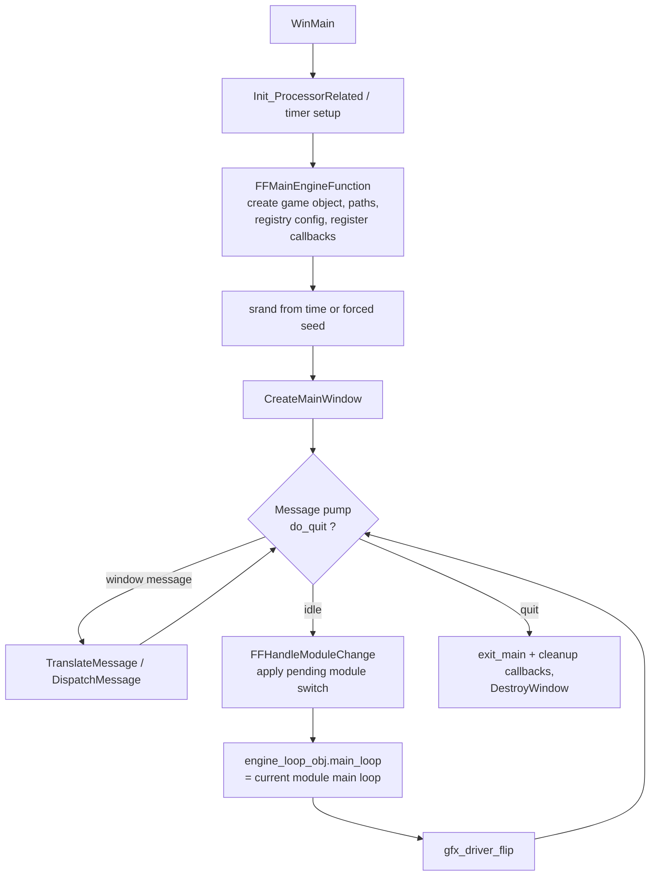
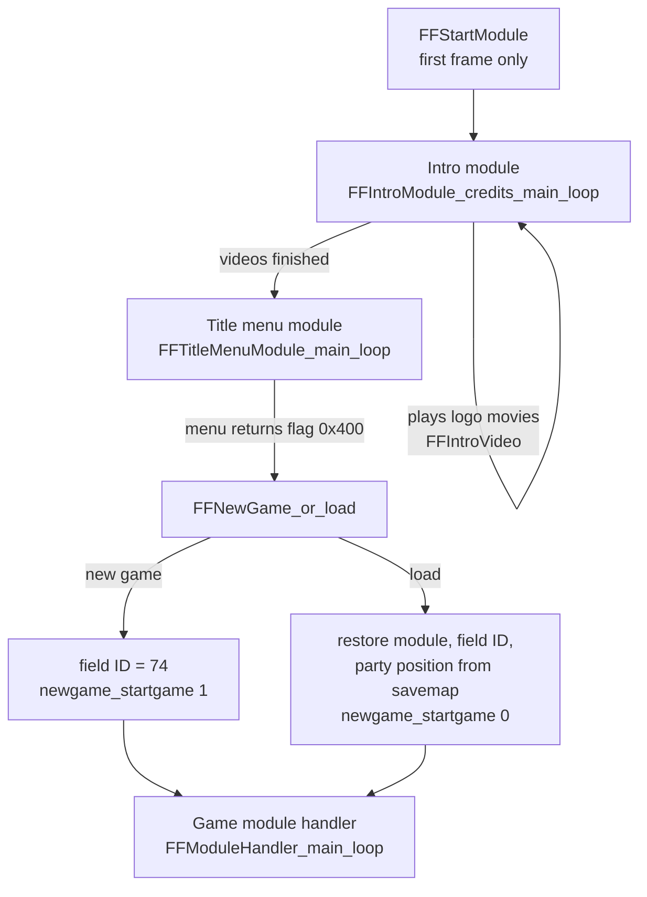
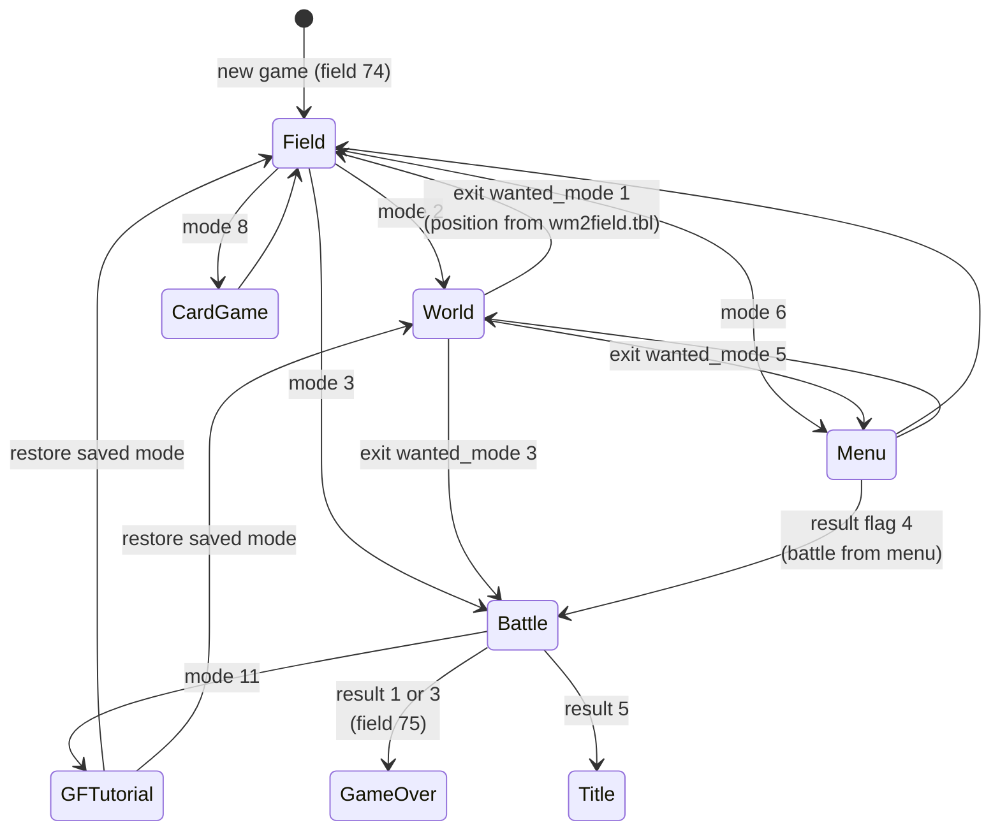

1. TOC
{:toc}

# Engine startup and main loop

This page describes how the PC executable (FF8_EN.exe, 2000 release) boots, how the per-frame main loop works, and how the engine switches between the game's major modules (field, world map, battle, menu, card game). All information comes from static analysis of the executable; addresses are listed in the table at the end.

## Boot sequence

`WinMain` performs the whole engine bring-up:

1. CPU detection and timer capability setup.
2. `FFMainEngineFunction` creates the global **game object** (a large context structure holding the window handle, renderer state, timers and the module callbacks), registers the data paths (`ff8\data\eng\`, plus the `menu`, `battle`, `field` and `world` subdirectories), reads the registry configuration (graphics driver, bilinear filtering, world map effect toggles) and registers the initial engine callbacks:
   * `init` = `pubintro_init`
   * `cleanup` = `pubintro_cleanup`
   * `enter_main` = `pubintro_enter_main`
   * `exit_main` = `LoadMenuFiles`
   * `main_loop` = `FFStartModule`
3. The random generator is seeded from `time()` unless the game object carries a forced seed.
4. `CreateMainWindow` creates the window and the DirectDraw/Direct3D surfaces.
5. The Windows message pump runs until the quit flag is raised.

Each idle iteration of the message pump is one game frame: the engine first applies any pending module switch, then calls the current module's `main_loop` callback, then flips the frame buffer.

## Module switching mechanism

A *module* is a set of five callbacks stored in a `ModuleSwitchData` structure:

| Offset | Field | Role |
|--------|-------|------|
| 0x00 | `enter_main` | called once when the module becomes active |
| 0x04 | `exit_main` | called once when the module is left |
| 0x08 | `main_loop` | called every frame while the module is active |
| 0x0C | unknown | always 0 in every registration site |
| 0x10 | unknown | always 0 in every registration site |

Switching is deferred: `FFSwitchModule_set_game_loop` only copies the structure into the game object and raises a *pending switch* flag. On the next frame, `FFHandleModuleChange` (called at the top of the frame, before the module `main_loop`) performs the actual switch:

1. calls the **old** module's `exit_main`,
2. copies the pending callbacks into the active slots,
3. calls the **new** module's `enter_main`,
4. clears the pending flag.

This guarantees a module is never torn down in the middle of its own frame.

## From boot to the title screen

The first registered `main_loop` is `FFStartModule`. It immediately chains through the intro sequence:

* The intro module (`FFIntroModule_credits_main_loop`) renders the Squaresoft/EIDOS logos and movies; when `FFIntroVideo` reports completion it switches to the title menu module.
* The title menu module (`FFTitleMenuModule_main_loop`) runs the title screen through the menu system and contains the engine's frame limiter (busy-wait on the high-resolution timer). When the menu returns a result with bit `0x400` set, the game leaves the title screen; bit `1` of the same result selects *New Game*.
* `FFNewGame_or_load` runs once as `enter_main` of the next module: a new game forces field ID 74 (the intro sequence field), while loading a save restores the saved module (`SG_CURRENT_MODULE`: 1 = field, 2 = world map, 3 = battle), field ID and party position from the savemap.

## The game module handler

`FFModuleHandler_main_loop` is the master state machine of the whole game. It runs as the active `main_loop` *between* gameplay modules: every gameplay module (field, world map, battle...) returns control to it by setting `mode_StateGlobal` and letting its own loop end. The handler then registers the next module.

Two globals drive it:

* `mode_StateGlobal` — the requested game mode (the switch value below).
* `ENGINE_STATE` — which module the engine is currently in / coming from. Observed values: 0 = field, 1 = world map (transition request), 2 = in world map, 3 = battle, 6 = menu, 10 = menu closing back to field.

Before dispatching, the handler performs two special checks:

* When `ENGINE_STATE` is 0 (field) and the disc number recorded in the savemap does not match the detected disc, it loads `wm2field.tbl` and switches to the **CD-check module** (`cdcheck_main_loop`).
* When `globalFieldNextModuleID` equals 4, it switches back to the **intro module** (used for the "reset to title" path, e.g. after a game over or the credits).

### mode_StateGlobal dispatch

| Value | Meaning | Module registered |
|-------|---------|-------------------|
| 1 | Field | `field_init` / `FFFieldModule_field_main_loop` / `FFFieldExitSystem` |
| 2 | World map | `worldmap_init` / `FFWorldModule_worldmap_main_loop` / `FFWorldExitSystem` (three-step sub-state, see below) |
| 3, 4 | Battle | `FFBattleTransitionInitSystem` / `FFBattleTransitionModule` / `FFBattleTransitionExitSystem` |
| 5, 7 | Unused | none (no-op) |
| 6, 10 | Menu | `menu_init` / `menu_or_tuto_main_loop_1` / `menu_exit` |
| 8 | Card game (Triple Triad) | `FFBattleInitSystem` / `battle_cardgame_main_loop` / `FFBattleExitSystem` |
| 9 | Debug field jump | loads `wm2field.tbl`, sets the field ID from `MenuState_opcode_menu_id`, then CD-check module into field |
| 11 | Post-battle GF tutorial | menu module once per newly obtained GF (see below) |

### World map sub-state (mode 2)

The world map entry runs a small sub-state machine (`worldmap_module_substate`):

* **Step 0** — records where the engine came from by translating `ENGINE_STATE` into `wanted_game_mode` (field → 6, world → 0 plus a field→world coordinate hand-off, battle → 2, menu → 4).
* **Step 1** — registers the world map module.
* **Step 2** — runs when the world map module gives control back. `wanted_game_mode` then selects the destination: 1 = jump to a field (the entry indexed by `wanted_game_mode+2` in `wm2field.tbl` provides field ID, X/Y coordinates, walkmesh triangle and direction), 3 = battle (mode 3), 5 = menu (mode 6).

### Battle entry and exit (modes 3/4 and 11)

Entering battle stores the encounter ID in `COMBAT_SCENE_ID` (taken from `MenuState_opcode_menu_id` when coming from the world map, otherwise from `wanted_game_mode`), calls `Battle_KeepMusicAfterBattle`, then registers the battle **transition** module, which runs the encounter swirl and the battle itself.

When the battle module returns, `battle_result_byte` decides what happens:

| Result | Effect |
|--------|--------|
| 5 | Reset to title screen (`globalFieldNextModuleID` = 4) |
| 1 | Game over — jumps to field 75 — unless bit 2 of the savemap byte at offset 0xB7 is set |
| 3 | Game over unless bit 1 of the same byte is set; when set, it also clears bit 0x40 of the savemap misc flags |
| other | Normal victory path |

On the normal path the handler saves whether the battle started from the field or the world map (`mode_to_restore_after_battle` = 1 or 2) and enters mode 11: for each of up to three entries in `LINKED_TO_GF_OBTAINED` that is not 0xFF, it launches the menu module with menu ID `entry + 5` (the "GF obtained" tutorial screens), then restores the saved mode.

### Menu return (modes 6/10)

The menu module communicates its result through `menu_result_flags`. Bit 0 distinguishes a plain close from a special action; bit 2 requests an immediate battle (the encounter ID is stored in the high 16 bits) — this is how the menu can chain straight into a battle. Otherwise the handler restores field or world map depending on where the menu was opened from.

## Address table

| Name | Address | Description |
|------|---------|-------------|
| `WinMain` | 0x5699AA | Engine entry point and message pump |
| `FFMainEngineFunction` | 0x401ED0 | Game object creation, config, callback registration |
| `CreateMainWindow` | 0x40AF51 | Window + DirectX surface creation |
| `FFHandleModuleChange` | 0x4099A8 | Applies a pending module switch at frame start |
| `FFSwitchModule_set_game_loop` | 0x409A57 | Requests a deferred module switch |
| `FFStartModule` | 0x4703B0 | First main loop, chains into the intro module |
| `pubintro_init` | 0x401890 | Engine init callback |
| `pubintro_cleanup` | 0x401A00 | Engine cleanup callback |
| `pubintro_enter_main` | 0x470310 | Engine enter_main callback |
| `LoadMenuFiles` | 0x470340 | Engine exit_main callback |
| `pubintro_credits_enter_main` | 0x52D970 | Intro module enter_main (resolution + timer setup) |
| `FFIntroModule_credits_main_loop` | 0x52DA20 | Intro logos/movies main loop |
| `FFIntroVideo` | 0x52F300 | Intro movie player, reports completion |
| `FFSwitchToTitleMenuModule` | 0x470520 | Switches to the title menu module |
| `FFTitleMenuModule_main_loop` | 0x4A24B0 | Title screen main loop (contains frame limiter) |
| `FFNewGame_or_load` | 0x470560 | New game / load dispatch (enter_main) |
| `newgame_startgame` | 0x52CA90 | Game state initialization for new game/load |
| `FFSwitchToGameModuleHandler` | 0x470630 | Switches to the game module handler |
| `FFModuleHandler_main_loop` | 0x4706B0 | Master game-mode state machine |
| `field_init_sub_46FD70` | 0x46FD70 | Field module enter_main |
| `FFFieldModule_field_main_loop` | 0x46FEE0 | Field module main loop |
| `FFFieldExitSystem` | 0x46FE80 | Field module exit_main |
| `worldmap_init` | 0x53EFC0 | World map module enter_main |
| `FFWorldModule_worldmap_main_loop` | 0x53F0F0 | World map module main loop |
| `FFWorldExitSystem_worldmap_exit` | 0x53F070 | World map module exit_main |
| `FFBattleTransitionInitSystem` | 0x559530 | Battle transition enter_main |
| `FFBattleTransitionModule` | 0x559890 | Battle transition + battle main loop |
| `FFBattleTransitionExitSystem` | 0x559820 | Battle transition exit_main |
| `FFBattleInitSystem` | 0x47CE10 | Card game module enter_main |
| `battle_cardgame_main_loop` | 0x47CF60 | Card game (Triple Triad) main loop |
| `FFBattleExitSystem` | 0x47CEF0 | Card game module exit_main |
| `menu_init_sub_4A2280` | 0x4A2280 | Menu module enter_main |
| `menu_or_tuto_main_loop_1` | 0x4A22C0 | Menu / tutorial main loop |
| `menu_exit_sub_4A22A0` | 0x4A22A0 | Menu module exit_main |
| `cdcheck_init` | 0x52DC00 | CD-check module enter_main |
| `cdcheck_main_loop` | 0x52DCF0 | CD-check module main loop |
| `mode_StateGlobal` | 0x1CD8FC6 | Requested game mode (dispatch table above) |
| `ENGINE_STATE` | 0x1CE0758 | Current/previous engine module |
| `globalFieldNextModuleID` | 0x1CE4760 | 4 = reset to title screen |
| `CURRENT_FIELD_ID` | 0x1CD2FC0 | Field to load next |
| `COMBAT_SCENE_ID` | 0x1CFF6E0 | Encounter ID for the next battle |
| `battle_result_byte` | 0x1CFF6E7 | Battle outcome (see table above) |
| `BOOL_LAUNCH_NEW_GAME` | 0x1CD2EC8 | Set from the title menu result |
| `wanted_game_mode` | 0x2036B4C | World map exit destination |
| `worldmap_module_substate` | 0x1CD2EE4 | World map entry sub-state |
| `battle_module_substate` | 0x1CD2EE0 | Battle entry sub-state |
| `cardgame_module_substate` | 0x1CD2EE8 | Card game entry sub-state |
| `menu_module_substate` | 0x1CD2EF0 | Menu entry sub-state |
| `gf_tutorial_substate` | 0x1CD2EEC | Mode 11 sub-state |
| `gf_tutorial_index` | 0x1CD2ED0 | Mode 11 loop counter (0..2) |
| `mode_to_restore_after_battle` | 0x1CD2ED4 | Mode restored after the GF tutorials |
| `menu_result_flags` | 0x1D2BB9C | Result flags returned by the menu module |
| `LINKED_TO_GF_OBTAINED` | 0x1CFF6E4 | Three bytes listing GFs obtained in the last battle (0xFF = none) |

Addresses are for FF8_EN.exe (2000 PC release) as mapped in IDA (image base 0x400000).
