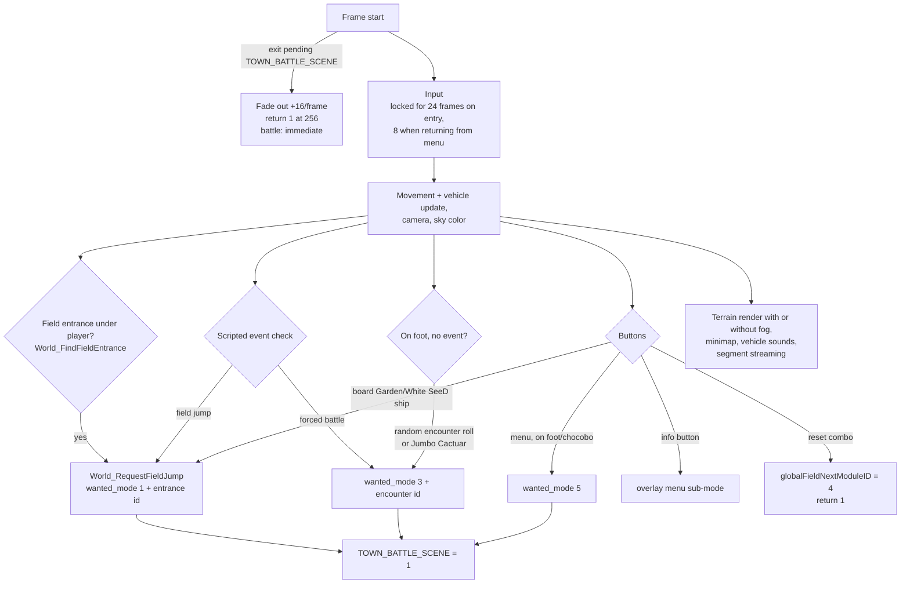

1. TOC
{:toc}

# WorldMap module runtime

This page describes how the world map module executes at runtime: initialization, the per-frame director, and how the module hands control back to the engine (field jumps, battles, menu). For the data formats see [wmx]({{ site.baseurl }}/technical-reference/worldmap/worldmap-wmx/), [wmset]({{ site.baseurl }}/technical-reference/worldmap/worldmap-wmset/), [texl]({{ site.baseurl }}/technical-reference/worldmap/worldmap-texl/), [chara.one]({{ site.baseurl }}/technical-reference/worldmap/worldmap-charaone/), [encounters]({{ site.baseurl }}/technical-reference/worldmap/worldmap-encounters/) and [music]({{ site.baseurl }}/technical-reference/worldmap/worldmap-music/). How the engine reaches this module is covered in [Engine startup and main loop]({{ site.baseurl }}/technical-reference/main/engine-startup-and-main-loop/).

## Module lifecycle

Like the field module, the world map is registered with three callbacks: `worldmap_init` (frame rate 30.5 fps, 320×224 viewport — 640×448 in high resolution — then `FFWorldInit`), the per-frame `FFWorldModule_worldmap_main_loop`, and `FFWorldExitSystem_worldmap_exit` (restores the viewport and frees the PSX VRAM texture pages).

The main loop is a render shell: clear/present, an optional overlay-menu sub-mode (`world_overlay_menu_state`, opened with the "info" button), and the call to `FFWorldDirector`. When the director returns 1 the loop switches back to `FFModuleHandler_main_loop`, which reads `wanted_game_mode` to decide the destination (see the mode 2 sub-state machine on the engine page).

## Initialization (FFWorldInit)

1. When entering from the field-to-world path, the world archives listed in the static table at `off_C75E80` (path + destination buffer pairs) are loaded.
2. `Wmset_ParseSections` splits the wmset file into its sections; `Wmset_SetupWorldmapVariant` applies the story-dependent map variant (savemap `WorldmapVariantFlags`).
3. Textures are uploaded to the emulated PSX VRAM (main texture list, wm39-style texture packs, drawable overlays).
4. Two 2 KB blocks are streamed from an archive with `Archive_IO_LoadFile` using block indexes from the wmset variant data (`byte_2036B72` × 0x800).
5. Music starts (`PlayMusic_SdMusicPlay` when a field handed over a track, otherwise the vehicle/area default via the music changer).
6. `Field_To_World_section9` computes the spawn position (wmset section 9 entries when coming from a field, saved world coordinates when loading a save), then the camera is initialized.
7. World character models load through the world chara.one loader, and the map-segment streaming loop runs until the blocks around the player are resident (`World_CountPendingMapSegments` / per-segment tick).
8. The player animation is selected: vehicle 49 (Ragnarok) uses animation 5, everything else animation 0.

## Per-frame director (FFWorldDirector)

Details worth knowing:

* **Exit transition** — despite its community name, `TOWN_BATTLE_SCENE` is the generic "exit transition started" flag for every destination. While set, the screen fades (`world_exit_fade_counter` += 16 per frame, done at 256) and the director then returns 1; a battle exit skips the fade.
* **Input** — pad state is double-buffered in `world_input_states[2]` with `world_input_frame_parity` selecting the current frame; "pressed this frame" is computed by XOR with the previous frame. Menu = bit 0x20, info menu = bit 0x800, board vehicle uses the same edge detection.
* **Field entrances** — walking onto an entrance region triggers `World_FindFieldEntrance`; the returned index is the entry in `wm2field.tbl` that the module handler uses to place the party in the destination field. Boarding the mobile Balamb Garden (vehicle 48) or the White SeeD ship (vehicle 50) jumps to fixed entrances 65 and 44; entrances 17/44/65 also update savemap `WorldmapVariantFlags` bit 0x20 depending on whether the vehicle can stay parked at the current position.
* **Encounters** — random encounters only roll while on foot with no active event: a scripted-event check first, then the standard roll (`WM_Encounter_wm123456`) and the Jumbo Cactuar special encounter. The chosen encounter ID goes to `wanted_game_mode` exactly like a field-triggered battle.
* **Menu** — only available on foot or on a chocobo (`world_currentVehicle` < 10 or 128); vehicles keep the button inactive.
* **Minimap** — `world_minimapMode`: 1 = corner planet minimap, 2 = corner zoomed map, 3 = fullscreen map.
* **Streaming** — map segments stream in continuously around the player; the loader state pauses when a music change is in flight (`World_MusicChanger`).
* **Fog toggle** — the registry flag `WORLDMAP_WITHOUT_FOG` (GraphicsGF bit) selects between the fogged and fogless terrain renderers each frame.
* **Docking/arrival animations** — `world_docking_state` (0x2036B70) is a small struct: +0 is the context byte (0 = normal, 1/2 = docking sequence for block A/B running, 3/4 = variants, 12 = world rendering disabled), +2/+3 hold the two **docking animation block IDs** streamed as 2 KB chunks during `FFWorldInit` (0xFF = none), +4 the pending field entrance. `World_UpdateDockingAnimations` (0x545480) advances the keyframed objects of those blocks each frame (camera-distance gated) and returns a completion bitmask; a completed sequence triggers the matching field entrance — this drives sequences like Balamb Garden or Ragnarok landing at a dock/station.

## Vehicle IDs observed in the director

| `world_currentVehicle` | Meaning |
|------------------------|---------|
| < 10 | On foot / party members |
| 32–40 | Cars |
| 48 | Balamb Garden (mobile) |
| 49 | Ragnarok |
| 50 | White SeeD ship |
| 128 | Chocobo |
| 132 | (special, grouped with vehicles for engine sound) |

## Address table

| Name | Address | Description |
|------|---------|-------------|
| `worldmap_init` | 0x53EFC0 | Module init (viewport + FFWorldInit) |
| `FFWorldInit` | 0x53F310 | Archive loading, wmset parsing, spawn, streaming warm-up |
| `FFWorldModule_worldmap_main_loop` | 0x53F0F0 | Module main loop (render shell) |
| `FFWorldExitSystem_worldmap_exit` | 0x53F070 | Module exit (viewport restore, VRAM free) |
| `FFWorldDirector` | 0x53FAC0 | Per-frame world logic (diagram above) |
| `World_HandleInputs` | 0x5573C0 | Pad/keyboard → movement intents |
| `World_CameraControl` | 0x552AD0 | Camera update |
| `World_FindFieldEntrance` | 0x54CD40 | Entrance region test at player position |
| `World_RequestFieldJump` | 0x544630 | Sets wanted_game_mode = 1 + entrance id, starts exit |
| `WM_Encounter_wm123456` | 0x541C80 | Random encounter roll |
| `World_JumboCactuarEncounter` | 0x54E730 | Jumbo Cactuar special encounter |
| `World_MusicChanger` | 0x543340 | Area/vehicle music transitions |
| `World_CountPendingMapSegments` | 0x5531F0 | Streaming: remaining segments around player |
| `Wmset_ParseSections` | 0x542DA0 | wmset section table parsing |
| `Field_To_World_section9` | 0x548080 | Spawn position from wmset section 9 / savemap |
| `jumpFromFieldToWorldmap` | 0x522200 | Field-side hand-over before entering the module |
| `TOWN_BATTLE_SCENE` | 0x203ED2C | Exit-transition flag (all destinations) |
| `world_exit_fade_counter` | 0x2040078 | Exit fade progress (0→256) |
| `world_module_first_frame` | 0x203FD50 | First-frame flag |
| `world_input_lock_frames` | 0x203FD54 | Input lock countdown after entry |
| `world_input_states` | 0x203FDE8 | Double-buffered pad state (2 dwords) |
| `world_input_frame_parity` | 0x20409BC | Which input buffer is current |
| `world_overlay_menu_state` | 0x2036AE0 | Info-menu overlay sub-mode |
| `world_currentVehicle` | 0x20409E0 | Current vehicle ID (table above) |
| `world_minimapMode` | 0xC75CF8 | Minimap display mode (1–3) |
| `WORLD_MAP_COORD_X/Y/Z` | 0x203EE80/84/88 | Player world position |
| `wanted_game_mode` | 0x2036B4C | Destination handed to the module handler |

Addresses are for FF8_EN.exe (2000 PC release) as mapped in IDA (image base 0x400000).
